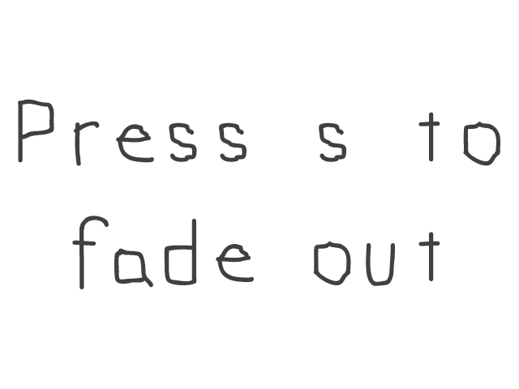

# Lazy Foo' Productions

# Alpha Blending


Thanks to new hardware accelerated rendering, transparency is much faster in SDL 2.0\. Here we'll use alpha modulation (which works much like
[color modulation](index-12.php.htm)) to control the transparency of a texture.
```cpp
//Texture wrapper class
class LTexture
{
public:
//Initializes variables
LTexture();
//Deallocates memory
~LTexture();
//Loads image at specified path
bool loadFromFile( std::string path );
//Deallocates texture
void free();
//Set color modulation
void setColor( Uint8 red, Uint8 green, Uint8 blue );
//Set blending
void setBlendMode( SDL_BlendMode blending );
//Set alpha modulation
void setAlpha( Uint8 alpha );
//Renders texture at given point
void render( int x, int y, SDL_Rect* clip = NULL );
//Gets image dimensions
int getWidth();
int getHeight();
private:
//The actual hardware texture
SDL_Texture* mTexture;
//Image dimensions
int mWidth;
int mHeight;
};
```
Here we're going to add two functions to support alpha transparency on a texture. First there's setAlpha which will function much like setColor did in the color modulation tutorial.
There's also setBlendMode which will control how the texture is blended. In order to get blending to work properly, you must set the blend mode on the texture. We'll cover this in
detail later.
```cpp
bool loadMedia()
{
//Loading success flag
bool success = true;
//Load front alpha texture
if( !gModulatedTexture.loadFromFile( "13_alpha_blending/fadeout.png" ) )
{
printf( "Failed to load front texture!n" );
success = false;
}
else
{
//Set standard alpha blending
gModulatedTexture.setBlendMode( SDL_BLENDMODE_BLEND );
}
//Load background texture
if( !gBackgroundTexture.loadFromFile( "13_alpha_blending/fadein.png" ) )
{
printf( "Failed to load background texture!n" );
success = false;
}
return success;
}
```
Here in the texture loading function we're loading the front texture we're going to alpha blend and a background texture. As the front texture gets more transparent, we'll be able to
see more of the back texture. As you can see in the code, after we load the front texture successfully we set the
[SDL BlendMode](http://wiki.libsdl.org/SDL_BlendMode) to blend so blending is enabled. Since the background isn't going to be transparent, we don't
have to set the blending on it.

Now how does alpha work? Alpha is opacity, and the lower the opacity the more we can see through it. Like red, green, or blue color components it goes from 0 to 255 when modulating
it. The best way to understand it is with some examples. Say if we had the front image on a white background.

This is the front image at 255 (100% alpha):


This is the front image at 191 (75% alpha):



This is the front image at 127 (50% alpha):


This is the front image at 63 (25% alpha):


This is the front image at 0 (0% alpha):


As you can see, the lower the alpha the more transparent it is.
```cpp
void LTexture::setBlendMode( SDL_BlendMode blending )
{
//Set blending function
SDL_SetTextureBlendMode( mTexture, blending );
}
void LTexture::setAlpha( Uint8 alpha )
{
//Modulate texture alpha
SDL_SetTextureAlphaMod( mTexture, alpha );
}
```
Here are the actual SDL functions that do the actual work.
[SDL_SetTextureBlendMode](http://wiki.libsdl.org/SDL_SetTextureBlendMode) in setBlendMode allows us to enable blending and
[SDL_SetTextureAlphaMod](http://wiki.libsdl.org/SDL_SetTextureAlphaMod) allows us to set the amount of alpha for the whole texture.
```cpp
  //Main loop flag
bool quit = false;
//Event handler
SDL_Event e;
//Modulation component
Uint8 a = 255;
//While application is running
while( !quit )
{
```
Right before entering the main loop, we declare a variable to control how much alpha the texture has. It is initialized to 255 so the front texture starts out completely opaque.
```cpp
            //Handle events on queue
while( SDL_PollEvent( &e ) != 0 )
{
//User requests quit
if( e.type == SDL_QUIT )
{
quit = true;
}
//Handle key presses
else if( e.type == SDL_KEYDOWN )
{
//Increase alpha on w
if( e.key.keysym.sym == SDLK_w )
{
//Cap if over 255
if( a + 32 > 255 )
{
a = 255;
}
//Increment otherwise
else
{
a += 32;
}
}
//Decrease alpha on s
else if( e.key.keysym.sym == SDLK_s )
{
//Cap if below 0
if( a - 32 < 0 )
{
a = 0;
}
//Decrement otherwise
else
{
a -= 32;
}
}
}
}
```
The event loop handles quit events and making the alpha value go up/down with the w/s keys.
```cpp
           //Clear screen
SDL_SetRenderDrawColor( gRenderer, 0xFF, 0xFF, 0xFF, 0xFF );
SDL_RenderClear( gRenderer );
//Render background
gBackgroundTexture.render( 0, 0 );
//Render front blended
gModulatedTexture.setAlpha( a );
gModulatedTexture.render( 0, 0 );
//Update screen
SDL_RenderPresent( gRenderer );
```
At the end of the main loop we do our rendering. After clearing the screen we render the background first and then we render the front modulated texture over it. Right before
rendering the front texture, we set its alpha value. Try increasing/decreasing the alpha value to see how transparency affects the rendering.

Download the media and source code for this tutorial [here](zip/13_alpha_blending.zip).
