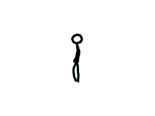
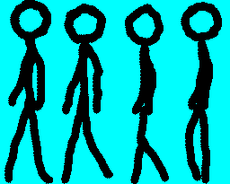

# Lazy Foo' Productions

# Animated Sprites and VSync



Animation in a nutshell is just showing one image after another to create the illusion of motion. Here we'll be showing different sprites to animate a stick figure.

Say if we had these frames of animation (that clearly demonstrate I am not an animator):



And showed one right after the other every 10th of a second we'd get this animation:


Since images in SDL 2 are typically SDL_Textures, animating in SDL is a matter of showing different parts of a texture (or different whole textures) one right after the other.
```cpp
//Walking animation
const int WALKING_ANIMATION_FRAMES = 4;
SDL_Rect gSpriteClips[ WALKING_ANIMATION_FRAMES ];
LTexture gSpriteSheetTexture;
```
So here we have the [spritesheet with sprites](index-11.php.htm) that we're going to use for the animation.
```cpp
         //Create vsynced renderer for window
gRenderer = SDL_CreateRenderer( gWindow, -1, SDL_RENDERER_ACCELERATED | SDL_RENDERER_PRESENTVSYNC );
if( gRenderer == NULL )
{
printf( "Renderer could not be created! SDL Error: %sn", SDL_GetError() );
success = false;
}
```
For this (and future tutorials), we want to use Vertical Sync. VSync allows the rendering to update at the same time as when your monitor updates during vertical refresh. For this
tutorial it will make sure the animation doesn't run too fast. Most monitors run at about 60 frames per second and that's the assumption we're making here. If you have a different
monitor refresh rate, that would explain why the animation is running too fast or slow.
```cpp
bool loadMedia()
{
//Loading success flag
bool success = true;
//Load sprite sheet texture
if( !gSpriteSheetTexture.loadFromFile( "14_animated_sprites_and_vsync/foo.png" ) )
{
printf( "Failed to load walking animation texture!n" );
success = false;
}
else
{
//Set sprite clips
gSpriteClips[ 0 ].x =   0;
gSpriteClips[ 0 ].y =   0;
gSpriteClips[ 0 ].w =  64;
gSpriteClips[ 0 ].h = 205;
gSpriteClips[ 1 ].x =  64;
gSpriteClips[ 1 ].y =   0;
gSpriteClips[ 1 ].w =  64;
gSpriteClips[ 1 ].h = 205;
gSpriteClips[ 2 ].x = 128;
gSpriteClips[ 2 ].y =   0;
gSpriteClips[ 2 ].w =  64;
gSpriteClips[ 2 ].h = 205;
gSpriteClips[ 3 ].x = 196;
gSpriteClips[ 3 ].y =   0;
gSpriteClips[ 3 ].w =  64;
gSpriteClips[ 3 ].h = 205;
}
return success;
}
```
After we load the sprite sheet we want to define the sprites for the individual frames of animation.
```cpp
        //Main loop flag
bool quit = false;
//Event handler
SDL_Event e;
//Current animation frame
int frame = 0;
```
Before the main loop we have to declare a variable to keep track of the current frame of animation.
```cpp
              //Render current frame
SDL_Rect* currentClip = &gSpriteClips[ frame / 4 ];
gSpriteSheetTexture.render( ( SCREEN_WIDTH - currentClip->w ) / 2, ( SCREEN_HEIGHT - currentClip->h ) / 2, currentClip );
//Update screen
SDL_RenderPresent( gRenderer );
```
After the screen is cleared in the main loop, we want to render the current frame of animation.

The animation goes from frames 0 to 3\. Since there are only 4 frames of animation, we want to slow down the animation a bit. This is why when we get the current clip sprite, we want
to divide the frame by 4\. This way the actual frame of animation only updates every 4 frames since with int data types 0 / 4 = 0, 1 / 4 = 0, 2 / 4 = 0, 3 / 4 = 0, 4 / 4 = 1,
5 / 4 = 1, etc.

After we get the current sprite, we want to render it to the screen and update the screen.
```cpp
    //Go to next frame
++frame;
//Cycle animation
if( frame / 4 >= WALKING_ANIMATION_FRAMES )
{
frame = 0;
}
}
```
Now in order for the frame to update, we need to increment the frame value every frame. If we didn't, then the animation would stay at the first frame.

We also want the animation to cycle, so when the frame hits the final value ( 16 / 4 = 4 ) we reset the frame back to 0 so the animation starts over again.

After we update the frame by either incrementing it or cycling it back to 0, we reach the end of the main loop. This main loop will keep showing a frame and updating the animation
value to animate the sprite.

Download the media and source code for this tutorial [here](zip/14_animated_sprites_and_vsync.zip).
