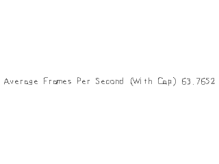

# Lazy Foo' Productions


# Capping Frame Rate




Another thing we can do with [SDL timers](index-23.php.htm) is manually cap the frame rate. Here we'll disable vsync and maintain a maximum frame rate.
```cpp
//Screen dimension constants
const int SCREEN_WIDTH = 640;
const int SCREEN_HEIGHT = 480;
const int SCREEN_FPS = 60;
const int SCREEN_TICKS_PER_FRAME = 1000 / SCREEN_FPS;
```
For this demo, we're going render our frame normally, but at the end of the frame we're going to wait until the frame time is completed. For example here, when you want to render at
60 fps you have to spend 16 and 2/3rd milliseconds per frame ( 1000ms / 60 frames ). This is why here we calculate the number of ticks per frame in milliseconds.
```cpp
       //Create renderer for window
gRenderer = SDL_CreateRenderer( gWindow, -1, SDL_RENDERER_ACCELERATED );
```
As you can see, we're disabling VSync for this demo because we'll be manually capping the frame rate.
```     cpp  
     //Main loop flag
bool quit = false;
//Event handler
SDL_Event e;
//Set text color as black
SDL_Color textColor = { 0, 0, 0, 255 };
//The frames per second timer
LTimer fpsTimer;
//The frames per second cap timer
LTimer capTimer;
//In memory text stream
std::stringstream timeText;
//Start counting frames per second
int countedFrames = 0;
fpsTimer.start();
```
For this program we'll not only need a timer to [calculate the frame rate](index-24.php.htm), but also a timer to cap the frames per
second. Here before we enter the main loop we declare some variables and start the fps calculator timer.

```cpp
      //While application is running
while( !quit )
{
//Start cap timer
capTimer.start();
```
To cap the FPS we need to know how long the frame has taken to render which is why we start a timer at the beginning of each frame.
```cpp
     //Handle events on queue
while( SDL_PollEvent( &e ) != 0 )
{
//User requests quit
if( e.type == SDL_QUIT )
{
quit = true;
}
}
//Calculate and correct fps
float avgFPS = countedFrames / ( fpsTimer.getTicks() / 1000.f );
if( avgFPS > 2000000 )
{
avgFPS = 0;
}
//Set text to be rendered
timeText.str( "" );
timeText << "Average Frames Per Second (With Cap) " << avgFPS;
//Render text
if( !gFPSTextTexture.loadFromRenderedText( timeText.str().c_str(), textColor ) )
{
printf( "Unable to render FPS texture!n" );
}
//Clear screen
SDL_SetRenderDrawColor( gRenderer, 0xFF, 0xFF, 0xFF, 0xFF );
SDL_RenderClear( gRenderer );
//Render textures
gFPSTextTexture.render( ( SCREEN_WIDTH - gFPSTextTexture.getWidth() ) / 2, ( SCREEN_HEIGHT - gFPSTextTexture.getHeight() ) / 2 );
//Update screen
SDL_RenderPresent( gRenderer );
++countedFrames;
```
Here we have frame rendering and fps calculation code from before.
```cpp
     //If frame finished early
int frameTicks = capTimer.getTicks();
if( frameTicks < SCREEN_TICKS_PER_FRAME )
{
//Wait remaining time
SDL_Delay( SCREEN_TICKS_PER_FRAME - frameTicks );
}
}
```
Finally here we have the code to cap the frame rate. First we get how many ticks the frame took to complete. If the number of ticks the frame took to execute is less than the ticks
needed per frame, we then delay for the remaining time to prevent the application from running too fast.

There's a reason we'll using VSync for these tutorials as opposed to manually capping the frame rate. When running this application, you'll notice that it runs slightly fast. Since
we're using integers (because floating point numbers are not precise), the ticks per frame will be 16ms as opposed to the exact 16 2/3ms. This solution is more of a stop gap in case
you have to deal with hardware that does not support VSync.
</div><div class="tutFooter">
Download the media and source code for this tutorial [here](zip/25_capping_frame_rate.zip).
