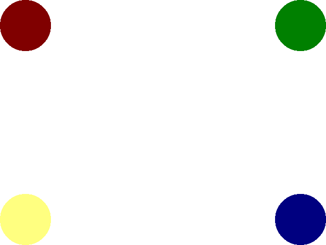

# Lazy Foo' Productions

# Clip Rendering and Sprite Sheets


Sometimes you only want to render part of a texture. A lot of times games like to keep multiple images on the same sprite sheet as opposed to having a bunch of
textures. Using clip rendering, we can define a portion of the texture to render as opposed to rendering the whole thing.
```cpp
//Texture wrapper class
class LTexture
{
public:
//Initializes variables
LTexture();
//Deallocates memory
~LTexture();
//Loads image at specified path
bool loadFromFile( std::string path );
//Deallocates texture
void free();
//Renders texture at given point
void render( int x, int y, SDL_Rect* clip = NULL );
//Gets image dimensions
int getWidth();
int getHeight();
private:
//The actual hardware texture
SDL_Texture* mTexture;
//Image dimensions
int mWidth;
int mHeight;
};
```
Here we're making a small tweak to the rendering function in the texture class. The render function now accepts a rectangle defining which portion of the texture we want to render.
We give it a default argument of NULL in case we want to render the whole texture.
```cpp
//Scene sprites
SDL_Rect gSpriteClips[ 4 ];
LTexture gSpriteSheetTexture;
```
For this tutorial, we're going to take this sprite sheet:


And render each sprite in a different corner:



So we're going to need a texture image and 4 rectangles to define the sprites, which are the variables you see declared here.
```cpp
void LTexture::render( int x, int y, SDL_Rect* clip )
{
//Set rendering space and render to screen
SDL_Rect renderQuad = { x, y, mWidth, mHeight };
//Set clip rendering dimensions
if( clip != NULL )
{
renderQuad.w = clip->w;
renderQuad.h = clip->h;
}
//Render to screen
SDL_RenderCopy( gRenderer, mTexture, clip, &renderQuad );
}
```
Here's the new rendering function for the texture class that supports clip rendering. It's mostly the same as the previous
[texture rendering function](index-10.php.htm) but with two changes.

First, since when you're clipping and you're using the dimensions of the clip rectangle instead of the texture, we're going to set the width/height of the destination rectangle (here
called renderQuad) to the size of the clip rectangle.

Secondly, we're going to pass in the clip rectangle to SDL_RenderCopy as the source rectangle. The source rectangle defines what part of the texture you want to render. When the
source rectangle is NULL, the whole texture is rendered.
```cpp
bool loadMedia()
{
//Loading success flag
bool success = true;
//Load sprite sheet texture
if( !gSpriteSheetTexture.loadFromFile( "11_clip_rendering_and_sprite_sheets/dots.png" ) )
{
printf( "Failed to load sprite sheet texture!n" );
success = false;
}
else
{
//Set top left sprite
gSpriteClips[ 0 ].x =   0;
gSpriteClips[ 0 ].y =   0;
gSpriteClips[ 0 ].w = 100;
gSpriteClips[ 0 ].h = 100;
//Set top right sprite
gSpriteClips[ 1 ].x = 100;
gSpriteClips[ 1 ].y =   0;
gSpriteClips[ 1 ].w = 100;
gSpriteClips[ 1 ].h = 100;
//Set bottom left sprite
gSpriteClips[ 2 ].x =   0;
gSpriteClips[ 2 ].y = 100;
gSpriteClips[ 2 ].w = 100;
gSpriteClips[ 2 ].h = 100;
//Set bottom right sprite
gSpriteClips[ 3 ].x = 100;
gSpriteClips[ 3 ].y = 100;
gSpriteClips[ 3 ].w = 100;
gSpriteClips[ 3 ].h = 100;
}
return success;
}
```
The media loading function loads the texture and then defines the clip rectangles for the circle sprites if the texture loaded successfully.
```cpp
 //While application is running
while( !quit )
{
//Handle events on queue
while( SDL_PollEvent( &e ) != 0 )
{
//User requests quit
if( e.type == SDL_QUIT )
{
quit = true;
}
}
//Clear screen
SDL_SetRenderDrawColor( gRenderer, 0xFF, 0xFF, 0xFF, 0xFF );
SDL_RenderClear( gRenderer );
//Render top left sprite
gSpriteSheetTexture.render( 0, 0, &gSpriteClips[ 0 ] );
//Render top right sprite
gSpriteSheetTexture.render( SCREEN_WIDTH - gSpriteClips[ 1 ].w, 0, &gSpriteClips[ 1 ] );
//Render bottom left sprite
gSpriteSheetTexture.render( 0, SCREEN_HEIGHT - gSpriteClips[ 2 ].h, &gSpriteClips[ 2 ] );
//Render bottom right sprite
gSpriteSheetTexture.render( SCREEN_WIDTH - gSpriteClips[ 3 ].w, SCREEN_HEIGHT - gSpriteClips[ 3 ].h, &gSpriteClips[ 3 ] );
//Update screen
SDL_RenderPresent( gRenderer );
}
```
Finally here in the main loop we render the same texture 4 times, but we're rendering a different portion of the sprite sheet in different places each call.

Download the media and source code for this tutorial [here](zip/11_clip_rendering_and_sprite_sheets.zip).
