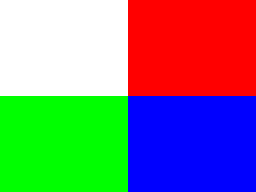
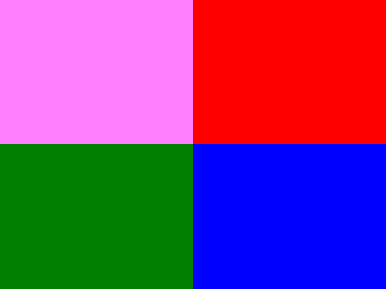

# Lazy Foo' Productions


# Color Modulation



Color modulation allows you to alter the color of your rendered textures. Here we're going to modulate a texture using various colors.
```cpp
//Texture wrapper class
class LTexture
{
public:
//Initializes variables
LTexture();
//Deallocates memory
~LTexture();
//Loads image at specified path
bool loadFromFile( std::string path );
//Deallocates texture
void free();
//Set color modulation
void setColor( Uint8 red, Uint8 green, Uint8 blue );
//Renders texture at given point
void render( int x, int y, SDL_Rect* clip = NULL );
//Gets image dimensions
int getWidth();
int getHeight();
private:
//The actual hardware texture
SDL_Texture* mTexture;
//Image dimensions
int mWidth;
int mHeight;
};
```
We're adding a function to the texture wrapper class that will allow the texture modulation to be set. All it does is take in a red, green, and blue color components.
```cpp
void LTexture::setColor( Uint8 red, Uint8 green, Uint8 blue )
{
//Modulate texture
SDL_SetTextureColorMod( mTexture, red, green, blue );
}
```
And setting texture modulation is as easy as making a call to [SDL_SetTextureColorMod](http://wiki.libsdl.org/SDL_SetTextureColorMod). You just pass in
the texture you want to modulate and the color you want to modulate with.

Now how does color modulation work? Let's say you have this texture:


And you modulate it with red 255, green 128, and blue 255\. You'll end up with this:



You may have noticed that SDL_SetTextureColorMod accepts Uint8 as arguments for the color components. An **U**int**8** is just an integer that is **U**nsigned and
**8**bit. This means it goes from 0 to 255\. 128 is about halfway between 0 and 255, so when you modulate green to 128 it halves the green component for any pixel on the texture.

The red and blue squares don't get affected because they have no green in them, but the green becomes half as bright and the white turns a light magenta (magenta is red 255, green 0,
blue 255). Color modulation is just a way to multiply a color throughout the whole texture.
```cpp
 //Main loop flag
bool quit = false;
//Event handler
SDL_Event e;
//Modulation components
Uint8 r = 255;
Uint8 g = 255;
Uint8 b = 255;
```
Here we are right before the main loop. For this demo we're going to modulate the individual color components using key presses. To do that we'll need to keep track of the values
for the color components.
```cpp
    //While application is running
while( !quit )
{
//Handle events on queue
while( SDL_PollEvent( &e ) != 0 )
{
//User requests quit
if( e.type == SDL_QUIT )
{
quit = true;
}
//On keypress change rgb values
else if( e.type == SDL_KEYDOWN )
{
switch( e.key.keysym.sym )
{
//Increase red
case SDLK_q:
r += 32;
break;
//Increase green
case SDLK_w:
g += 32;
break;
//Increase blue
case SDLK_e:
b += 32;
break;
//Decrease red
case SDLK_a:
r -= 32;
break;
//Decrease green
case SDLK_s:
g -= 32;
break;
//Decrease blue
case SDLK_d:
b -= 32;
break;
}
}
}
```
In our event loop we'll have the q, w, and e keys increase the red, green, and blue components and we'll have the a, s, and d key decrease the red, green, and blue components. They
increase/decrease the components by 32 so it's noticable with every key press.
```cpp
    //Clear screen
SDL_SetRenderDrawColor( gRenderer, 0xFF, 0xFF, 0xFF, 0xFF );
SDL_RenderClear( gRenderer );
//Modulate and render texture
gModulatedTexture.setColor( r, g, b );
gModulatedTexture.render( 0, 0 );
//Update screen
SDL_RenderPresent( gRenderer );
}
```
And here we are setting the texture modulation and rendering the texture.

Download the media and source code for this tutorial [here](zip/12_color_modulation.zip).
