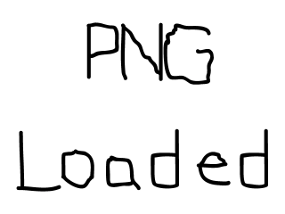

# Lazy Foo' Productions
# Extension Libraries and Loading Other Image Formats

SDL extension libraries allow you do things like load image files besides BMP, render TTF fonts, and play music. You can set up SDL_image to load PNG files, which
can save you a lot of disk space. In this tutorial we'll be covering how to install SDL_image.

SDL itself is an extension library since it adds game and media functionality that doesn't come standard with your C++ compiler. As you're setting up your extension
library, you'll realize it's nearly identical to installing SDL by itself. We'll be specifically installing SDL_image, but if you can install that extension library
you should be able to install any of them.

After you set up SDL_image, we'll cover [how to create load a PNG with SDL](Loading_PNGs_wit_SDL_image.md).
Select Your Operating System

|icon|system|
|-----|:--------:|
||[Windows](index-58.php.htm)|
||[Linux](index-59.php.htm)|
||[Mac OS X](index-60.php.htm)|
