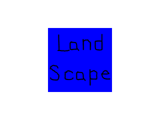

# Lazy Foo' Productions

# Extensions and Changing Orientation

So you learned how to set up the SDL2 library and you want to add SDL extension libraries. Fortunately, SDL_image/SDL_ttf/SDL_mixer are just another library you have to add on and if you already set up SDL2, youmade it through the hard part.

After we set up SDL_image, we'll cover [handling orientation change on Android/iOS](Extensions_and_Changing_Orientation_Handling_Orientation_Changes.md).
Select Your Mobile/Development Platform

|icon|system|
|-----|:--------:|
||[Windows Android](Setting_up_SDL_image_on_Windows_Android.md)|
||[Linux Android](index-66.php.htm)|
||[Mac Android](Setting_up_SDL_image_on_Mac_Android.md)|
||[iOS](index-68.php.htm)|
