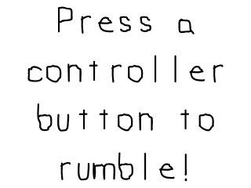

# Lazy Foo' Productions

# Force Feedback



Now that we know how to [how to use joysticks with SDL](Gamepads_and_Joysticks.md), we can now use the new haptics API to make the
controller shake.
```cpp
//Game Controller 1 handler with force feedback
SDL_Joystick* gGameController = NULL;
SDL_Haptic* gControllerHaptic = NULL;
```
A haptic device is something that gives some sort of physical feedback. In this case, it makes the controller rumble. The datatype for a haptics device is intuitively named
SDL_haptic.
```cpp   
 //Initialize SDL
if( SDL_Init( SDL_INIT_VIDEO | SDL_INIT_JOYSTICK | SDL_INIT_HAPTIC ) < 0 )
{
printf( "SDL could not initialize! SDL Error: %sn", SDL_GetError() );
success = false;
}
```
Like with the joysticks subsystem, you need to make sure to initialize the haptic specific subsystem in order to use haptics.
```cpp        
//Check for joysticks
if( SDL_NumJoysticks() < 1 )
{
printf( "Warning: No joysticks connected!n" );
}
else
{
//Load joystick
gGameController = SDL_JoystickOpen( 0 );
if( gGameController == NULL )
{
printf( "Warning: Unable to open game controller! SDL Error: %sn", SDL_GetError() );
}
else
{
//Get controller haptic device
gControllerHaptic = SDL_HapticOpenFromJoystick( gGameController );
if( gControllerHaptic == NULL )
{
printf( "Warning: Controller does not support haptics! SDL Error: %sn", SDL_GetError() );
}
else
{
//Get initialize rumble
if( SDL_HapticRumbleInit( gControllerHaptic ) < 0 )
{
printf( "Warning: Unable to initialize rumble! SDL Error: %sn", SDL_GetError() );
}
}
}
}
```
After we initialize the joystick, we need to get the haptics device from the joystick using
[SDL_HapticOpenFromJoystick](http://wiki.libsdl.org/SDL_HapticOpenFromJoystick) on an opened joystick. If we manage to get the haptic device from
controller we have to initialize the rumble using [SDL_HapticRumbleInit](http://wiki.libsdl.org/SDL_HapticRumbleInit).
```cpp
void close()
{
//Free loaded images
gSplashTexture.free();
//Close game controller with haptics
SDL_HapticClose( gControllerHaptic );
SDL_JoystickClose( gGameController );
gGameController = NULL;
gControllerHaptic = NULL;
//Destroy window
SDL_DestroyRenderer( gRenderer );
SDL_DestroyWindow( gWindow );
gWindow = NULL;
gRenderer = NULL;
//Quit SDL subsystems
IMG_Quit();
SDL_Quit();
}
```
Once we're done with a haptic device, we call [SDL_HapticClose](http://wiki.libsdl.org/SDL_HapticClose).
```cpp
                //Handle events on queue
while( SDL_PollEvent( &e ) != 0 )
{
//User requests quit
if( e.type == SDL_QUIT )
{
quit = true;
}
//Joystick button press
else if( e.type == SDL_JOYBUTTONDOWN )
{
//Play rumble at 75% strenght for 500 milliseconds
if( SDL_HapticRumblePlay( gControllerHaptic, 0.75, 500 ) != 0 )
{
printf( "Warning: Unable to play rumble! %sn", SDL_GetError() );
}
}
}
```
To actually make the controller rumble, you need to make it play some sort of rumbling. The easiest way to make your controller shake is by calling
[SDL_HapticRumblePlay](http://wiki.libsdl.org/SDL_HapticRumblePlay), which takes in the haptic device, strength in percentage, and duration of the rumble.
Here we make the controller rumble at 75% strength for half a second whenever a [SDL_JoyButtonEvent](http://wiki.libsdl.org/SDL_JoyButtonEvent) happens.

Now the SDL 2 haptics API has many more features not covered here including making custom effects, handling multi rumble devices, and handling haptic mice. You can check them out
in the [SDL 2 force feedback documentation](http://wiki.libsdl.org/CategoryForceFeedback).
</div><div class="tutFooter">
Download the media and source code for this tutorial [here](zip/20_force_feedback.zip).
