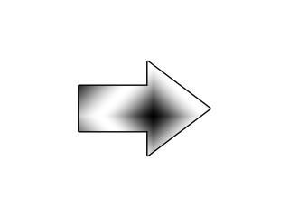

# Lazy Foo' Productions

# Gamepads and Joysticks



Just like with [mouse input](index-17.php.htm) and
[keyboard input](index-4.php.htm), SDL has the ability to read input from a joystick/gamepad/game controller. In this tutorial
we'll be making an arrow rotate based on the input of a joystick.
```cpp
//Analog joystick dead zone
const int JOYSTICK_DEAD_ZONE = 8000;
```
The way SDL handles analog sticks on a game controller is that it converts its position into a number between -32768 to 32767\. This mean a light tap could report a position of
1000+. We want to ignore light taps, so we want to create a dead zone where input from the joystick is ignored. This is why we define this constant and we'll see how it works later.
```cpp
//Game Controller 1 handler
SDL_Joystick* gGameController = NULL;
```
The data type for a game controller is [SDL_Joystick](http://wiki.libsdl.org/CategoryJoystick). Here we declare the global joystick handle we'll use to
interact with the joystick.
```cpp
bool init()
{
//Initialization flag
bool success = true;
//Initialize SDL
if( SDL_Init( SDL_INIT_VIDEO | SDL_INIT_JOYSTICK ) < 0 )
{
printf( "SDL could not initialize! SDL Error: %sn", SDL_GetError() );
success = false;
}
```
This is important.

Up until now, we've been only initializing video so we can render to the screen. Now we need to initialize the joystick subsystem or reading from joystick won't work.
```cpp
 //Set texture filtering to linear
if( !SDL_SetHint( SDL_HINT_RENDER_SCALE_QUALITY, "1" ) )
{
printf( "Warning: Linear texture filtering not enabled!" );
}
//Check for joysticks
if( SDL_NumJoysticks() < 1 )
{
printf( "Warning: No joysticks connected!n" );
}
else
{
//Load joystick
gGameController = SDL_JoystickOpen( 0 );
if( gGameController == NULL )
{
printf( "Warning: Unable to open game controller! SDL Error: %sn", SDL_GetError() );
}
}
```
After initializing the joystick subsystem, we want to open our joystick. First we call [SDL_NumJoysticks](http://wiki.libsdl.org/SDL_NumJoysticks) to
check if there is at least one joystick connected. If there is, we call [SDL_JoystickOpen](http://wiki.libsdl.org/SDL_JoystickOpen) to open the joystick
at index 0\. After the joystick is open, it will now report events to the SDL event queue.
```cpp
void close()
{
//Free loaded images
gArrowTexture.free();
//Close game controller
SDL_JoystickClose( gGameController );
gGameController = NULL;
//Destroy window
SDL_DestroyRenderer( gRenderer );
SDL_DestroyWindow( gWindow );
gWindow = NULL;
gRenderer = NULL;
//Quit SDL subsystems
IMG_Quit();
SDL_Quit();
}
```
After we're done with the joystick, we close it with [SDL_JoystickClose](http://wiki.libsdl.org/SDL_JoystickClose).
```cpp
    //Main loop flag
bool quit = false;
//Event handler
SDL_Event e;
//Normalized direction
int xDir = 0;
int yDir = 0;
```
For this demo, we want to keep track of the x and y direction. If the x equals -1, the joystick's x position is pointing left. If it is +1, the x position is pointing right.
The y position for joysticks has positive being up and negative being down, so y = +1 is up and y = -1 is down. If x or y is 0, that means it's in the dead zone and is in the center.
```cpp
       //Handle events on queue
while( SDL_PollEvent( &e ) != 0 )
{
//User requests quit
if( e.type == SDL_QUIT )
{
quit = true;
}
else if( e.type == SDL_JOYAXISMOTION )
{
//Motion on controller 0
if( e.jaxis.which == 0 )
{
//X axis motion
if( e.jaxis.axis == 0 )
{
//Left of dead zone
if( e.jaxis.value < -JOYSTICK_DEAD_ZONE )
{
xDir = -1;
}
//Right of dead zone
else if( e.jaxis.value > JOYSTICK_DEAD_ZONE )
{
xDir =  1;
}
else
{
xDir = 0;
}
}
```
In our event loop, we check if the joystick has moved by checking for a [SDL_JoyAxisEvent](http://wiki.libsdl.org/SDL_JoyAxisEvent). The "which"
variable says which controller the axis motion came from, and here we check that the event came from joystick 0.

Next we want to check whether it was a motion in the x direction or y direction, which the "axis" variable indicates. Typically, axis 0 is the x axis.

The "value" variable says what position the analog stick has on the axis. If the x position is less than the dead zone, the direction is set to negative. If the position is greater
than the dead zone, the direction is set to positive. If it's in the dead zone, the direction is set to 0.
```cpp
              //Y axis motion
else if( e.jaxis.axis == 1 )
{
//Below of dead zone
if( e.jaxis.value < -JOYSTICK_DEAD_ZONE )
{
yDir = -1;
}
//Above of dead zone
else if( e.jaxis.value > JOYSTICK_DEAD_ZONE )
{
yDir =  1;
}
else
{
yDir = 0;
}
}
}
}
}
```
Here we do the same thing again with the y axis, which is identified with the axis ID 1.
```cpp
         //Clear screen
SDL_SetRenderDrawColor( gRenderer, 0xFF, 0xFF, 0xFF, 0xFF );
SDL_RenderClear( gRenderer );
//Calculate angle
double joystickAngle = atan2( (double)yDir, (double)xDir ) * ( 180.0 / M_PI );
//Correct angle
if( xDir == 0 && yDir == 0 )
{
joystickAngle = 0;
}
```
Before we render the arrow which will point in the direction the the analog stick is pushed, we need to calculate the angle. We do this using the cmath function atan2, which stands
for arc tangent 2, AKA inverse tangent 2.

For those of you familiar with trigonometry, this is basically the inverse tangent function with some additional code inside that takes into account the which quadrant the values
are coming from.

For those of you only familiar with geometry, just know you give it the y position and x position and it will give you the angle in radians. SDL wants rotation angles in degrees, so
we have to convert the radians to degrees by multiplying it by 180 over Pi.

When both the x and y position are 0, we could get a garbage angle, so we correct the value to equal 0.
```cpp
              //Render joystick 8 way angle
gArrowTexture.render( ( SCREEN_WIDTH - gArrowTexture.getWidth() ) / 2, ( SCREEN_HEIGHT - gArrowTexture.getHeight() ) / 2, NULL, joystickAngle );
//Update screen
SDL_RenderPresent( gRenderer );
```
Finally we render the arrow rotated on the screen.

There are other joystick events like
[button presses](http://wiki.libsdl.org/SDL_JoyButtonEvent),
[pov hats](http://wiki.libsdl.org/SDL_JoyHatEvent), and
[pluggin in or removing a controller](http://wiki.libsdl.org/SDL_JoyDeviceEvent). They are fairly simple and you should be able to pick them up with some
look at the documentation and experimentation.

Download the media and source code for this tutorial [here](zip/19_gamepads_and_joysticks.zip).
