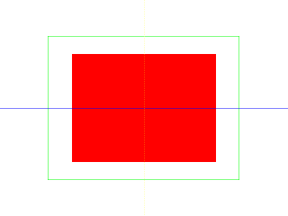
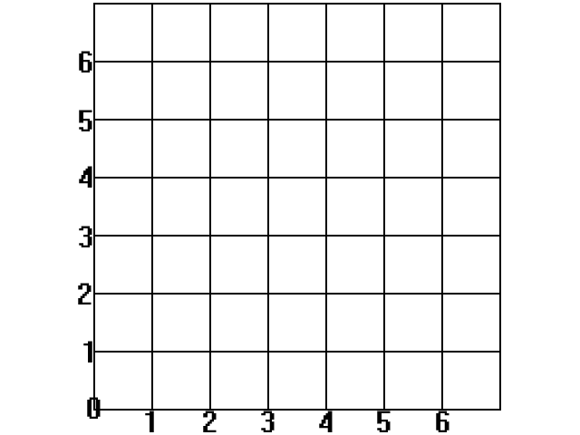
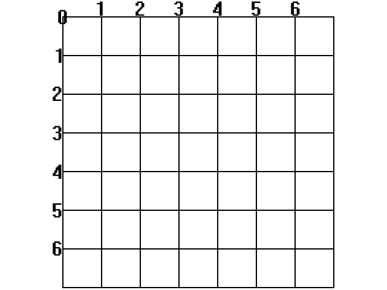
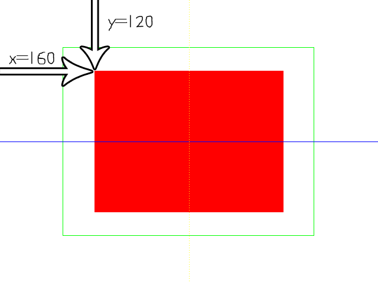

# Lazy Foo' Productions

# Geometry Rendering



Along with the new texturing API, SDL has new primitive rendering calls as part of its [rendering API](http://wiki.libsdl.org/CategoryRender).
So if you need some basic shapes rendered and you don't want to create additional graphics for them, SDL can save you the effort.
```cpp
bool loadMedia()
{
//Loading success flag
bool success = true;
//Nothing to load
return success;
}
```
So as you can see in our media loading function, we load no media. SDL's primitive rendering allows you to render shapes without loading special graphics.
```cpp
 //While application is running
while( !quit )
{
//Handle events on queue
while( SDL_PollEvent( &e ) != 0 )
{
//User requests quit
if( e.type == SDL_QUIT )
{
quit = true;
}
}
//Clear screen
SDL_SetRenderDrawColor( gRenderer, 0xFF, 0xFF, 0xFF, 0xFF );
SDL_RenderClear( gRenderer );
```
At the top of the main loop we handle the quit event like before and clear the screen. Also notice that we're setting the clearing color to white with SDL_SetRenderDrawColor every
frame as opposed to setting it once in the initialization function. We'll cover why this happens when we get to the end of the main loop.
```cpp
 //Render red filled quad
SDL_Rect fillRect = { SCREEN_WIDTH / 4, SCREEN_HEIGHT / 4, SCREEN_WIDTH / 2, SCREEN_HEIGHT / 2 };
SDL_SetRenderDrawColor( gRenderer, 0xFF, 0x00, 0x00, 0xFF );
SDL_RenderFillRect( gRenderer, &fillRect );
```
The first primitive we're going to draw is a fill rectangle, which is a solid rectangle.

First we define a rectangle to define the area we want to fill with color. If you never seen a struct initialized like this, know that the member variables that make up an SDL rect
are x, y, w, and h for the x position, y position, width, and height respectively. You can initialize a struct by giving it an array of variables in the order they are in the
struct. Here we're setting the rectangle one quarter of the screen width in the x direction, one quarter of the screen height in the y direction, and with half the screen's
width/height.

After defining the rectangle area, we set the rendering color with SDL_SetRenderDrawColor. This function takes in the renderer for the window we're using and the RGBA values for
the color we want to render with. R is the red component, G is green, B is blue, and A is alpha. Alpha controls how opaque something is and we'll cover that in the transparency
tutorial. These values go from 0 to 255 (or FF hex as you see above) and are mixed together to create all the colors you see on your screen. This call to SDL_SetRenderDrawColor sets the
drawing color to opaque red.

After the rectangle and color have been set, [SDL_RenderFillRect]('http://wiki.libsdl.org/SDL_RenderFillRect) is called to draw the rectangle.
```cpp
//Render green outlined quad
SDL_Rect outlineRect = { SCREEN_WIDTH / 6, SCREEN_HEIGHT / 6, SCREEN_WIDTH * 2 / 3, SCREEN_HEIGHT * 2 / 3 };
SDL_SetRenderDrawColor( gRenderer, 0x00, 0xFF, 0x00, 0xFF );
SDL_RenderDrawRect( gRenderer, &outlineRect );
```
You can also draw a rectangle outline with an empty center using [SDL_RenderDrawRect](http://wiki.libsdl.org/SDL_RenderDrawRect). As you can see it
pretty much works the same as a solid filled rectangle as this piece of code is almost the same as the one above it. The major difference is that this rectangle is 2 thirds of the
screen in size and that the color we're using here is green.

Also if you mess with the position of the rectangle. You may notice something strange about the y coordinate. Making the y coordinate larger makes it go down and making the y
coordinate smaller makes it go up. This is because SDL and many 2D rendering APIs use a different coordinate system.


Back in your algebra class, you probably learned about the cartesian coordinate system:



Where the x axis points to the right, the y axis points up, and the origin is in the bottom left corner.

SDL uses a different coordinate system:



The x axis still points to the right, but the y axis points down and the origin is in the top left.

So when we rendered the solid rectangle, the coordinate system functioned like this:



Also one thing to know is that SDL renders rectangles, surfaces, and textures from the top left corner.
```cpp
 //Draw blue horizontal line
SDL_SetRenderDrawColor( gRenderer, 0x00, 0x00, 0xFF, 0xFF );
SDL_RenderDrawLine( gRenderer, 0, SCREEN_HEIGHT / 2, SCREEN_WIDTH, SCREEN_HEIGHT / 2 );
```
Here is the code to draw a pixel thin line using [SDL_RenderDrawLine](http://wiki.libsdl.org/SDL_RenderDrawLine). First we set the color to blue, and
then give the rendering call the starting x/y position and ending x/y position. These position cause it to go horizontally straight across the screen.
```cpp
 //Draw vertical line of yellow dots
SDL_SetRenderDrawColor( gRenderer, 0xFF, 0xFF, 0x00, 0xFF );
for( int i = 0; i < SCREEN_HEIGHT; i += 4 )
{
SDL_RenderDrawPoint( gRenderer, SCREEN_WIDTH / 2, i );
}
//Update screen
SDL_RenderPresent( gRenderer );
}
```
The last bit of geometry we render is a sequence of dots using [SDL_RenderDrawPoint](http://wiki.libsdl.org/SDL_RenderDrawPoint). We're just taking a set
of points and drawing them from top to bottom. Again notice the y coordinate and the inverted y axis. After we're finished drawing all our geometry, we update the screen

Notice the call to SDL_SetRenderDrawColor. We're using 255 red and 255 green which combine together to make yellow. Remember that call to SDL_SetRenderDrawColor at the top of the
loop? If that wasn't there, the screen would be cleared with whatever color was last set with SDL_SetRenderDrawColor, resulting in a yellow background in this case.

Download the media and source code for this tutorial [here](zip/08_geometry_rendering.zip).
