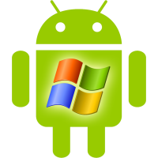

# Lazy Foo' Productions

# Hello Mobile

So you learned the basics of SDL on your desktop computer and you want to make ports of your applications for phones and tablets. SDL 2 fortunately has Android and iOS ports that help make the process less painful.

**DO NOT GO THROUGH THESE TUTORIALS** if you haven't gone through the previous ones. The mobile tutorials assume you already have experience with SDL 2\. Go learn the tutorials before this one because mobile
development is much, much more quirky than developing on desktop.

After you set up SDL, we'll cover [how to make your first mobile SDL game](Your_First_Mobile_SDL2_App.md).
Select Your Mobile/Development Platform

|icon|system|
|-----|:-------:|
||[Windows Android](Setting_up_SDL2_on_Windows_Android.md)|
||[Linux Android](index-62.php.htm)|
||[Mac Android](Setting_up_SDL2_on_Mac_Android.md)|
||[iOS](index-64.php.htm)|
