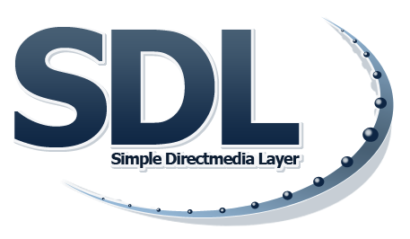
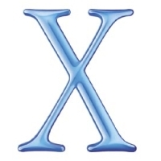

# Lazy Foo' Productions
# Hello SDL

So you learned the basics of C++, but you're sick of making little text based programs. In order to use things like graphics, sound, keyboards, joysticks, etc you need an API (Application Programmer's Interface) that takes all those hardware features and turns it into something C++ can interact with.

That's what SDL does. It takes the Windows/Linux/Mac/Android/iOS/etc tools and wraps them in a way that you can code something in SDL and compile it to what ever platform it supports. In order to use it, you need to install it.

SDL as a dynamically linked library. A dynamically linked library has 3 parts:
*   The header files (Library.h)
*   The library files (Library.lib for windows or libLibrary.a for *nix)
*   The binary files (Library.dll for windows or Library.so for *nix)

Your compiler needs to be able to find the header files when compiling so it knows what SDL_Init() and the other SDL functions and structures are. You can either configure your compiler to search in an additional directory where the SDL header files are located, or put the header files in with the rest of header files that your compiler comes with. If the compiler complains that it can't find SDL.h, it means the header files aren't in a place that the compiler looks for header files.

After your compiler compiles all your source files it has to link them together. In order to program to link properly, it needs to know the addresses of all your functions including the ones for SDL. For a dynamically linked library, these addresses are in the library file. The library file has the Import Address Table so your program can import the functions at runtime. Like with header files, You can either configure your compiler to search in an additional directory where the SDL library files are located, or put the library files in with the rest of library files that your compiler comes with. You also have to tell the linker to link against the library file in the linker. If the linker complains that it can't find -lSDL or SDL2.lib, it means the library files aren't in a place that the linker looks for library files. If the linker complains about an undefined reference, it probably means it was never told to link the library.

After your program is compiled and linked, you need to be able to link against the library when you run it. In order to run a dynamically linked application, you need to be able to import the library binaries at runtime. Your operating system needs to be able to find the library binary when you run your program. You can either put the library binaries in the same directory as your executable, or a directory that your operating system keeps library binary files.

After you set up SDL, we'll cover [how to create an SDL 2 window](hellosdlc.md).
Select Your Operating System

|icon|System|
|----|:-----:|
||[Windows](hellosdl_windows.md)|
||[Linux](Setting_up_SDL_2_on_Linux.md)|
||[Mac OS X](SettingupSDL2onMacOSX_Yosemite.md)|
