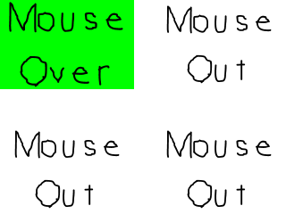

# Lazy Foo' Productions


# Mouse Events



Like with key presses, SDL has [event structures](index-3.php.htm) to handle mouse events such as mouse motion, mouse
button presses, and mouse button releasing. In this tutorial we'll make a bunch of buttons we can interact with.
```cpp
//Button constants
const int BUTTON_WIDTH = 300;
const int BUTTON_HEIGHT = 200;
const int TOTAL_BUTTONS = 4;
enum LButtonSprite
{
BUTTON_SPRITE_MOUSE_OUT = 0,
BUTTON_SPRITE_MOUSE_OVER_MOTION = 1,
BUTTON_SPRITE_MOUSE_DOWN = 2,
BUTTON_SPRITE_MOUSE_UP = 3,
BUTTON_SPRITE_TOTAL = 4
};
```
For this tutorial we'll have 4 buttons on the screen. Depending on whether the mouse moved over, clicked on, released on, or moved out of the button we'll display a different sprite.
These constants are here to define all this.
```cpp
//Texture wrapper class
class LTexture
{
public:
//Initializes variables
LTexture();
//Deallocates memory
~LTexture();
//Loads image at specified path
bool loadFromFile( std::string path );
#ifdef _SDL_TTF_H
//Creates image from font string
bool loadFromRenderedText( std::string textureText, SDL_Color textColor );
#endif
//Deallocates texture
void free();
//Set color modulation
void setColor( Uint8 red, Uint8 green, Uint8 blue );
//Set blending
void setBlendMode( SDL_BlendMode blending );
//Set alpha modulation
void setAlpha( Uint8 alpha );
//Renders texture at given point
void render( int x, int y, SDL_Rect* clip = NULL, double angle = 0.0, SDL_Point* center = NULL, SDL_RendererFlip flip = SDL_FLIP_NONE );
//Gets image dimensions
int getWidth();
int getHeight();
private:
//The actual hardware texture
SDL_Texture* mTexture;
//Image dimensions
int mWidth;
int mHeight;
};
```
We're making a slight modification to the texture class. For this tutorial we won't be [using SDL_ttf to render text](index-16.php.htm).
This means we don't need the loadFromRenderedText function. Rather than deleting code we may need in the future, we're going to wrap it in **if****def**ined
statements so the compiler will ignore it if we do not include SDL_ttf. Like #include, #ifdef is a macro which is used to talk to the compiler. In this case it says if SDL_ttf is
not defined, ignore this piece of code.
```cpp
//The mouse button
class LButton
{
public:
//Initializes internal variables
LButton();
//Sets top left position
void setPosition( int x, int y );
//Handles mouse event
void handleEvent( SDL_Event* e );
//Shows button sprite
void render();
private:
//Top left position
SDL_Point mPosition;
//Currently used global sprite
LButtonSprite mCurrentSprite;
};
```
Here is the class to represent a button. It has a constructor to initialize, a position setter, an event handler for the event loop, and a rendering function. It also has a position
and a sprite enumeration so we know which sprite to render for the button.
```cpp
#ifdef _SDL_TTF_H
bool LTexture::loadFromRenderedText( std::string textureText, SDL_Color textColor )
{
//Get rid of preexisting texture
free();
//Render text surface
SDL_Surface* textSurface = TTF_RenderText_Solid( gFont, textureText.c_str(), textColor );
if( textSurface == NULL )
{
printf( "Unable to render text surface! SDL_ttf Error: %sn", TTF_GetError() );
}
else
{
//Create texture from surface pixels
mTexture = SDL_CreateTextureFromSurface( gRenderer, textSurface );
if( mTexture == NULL )
{
printf( "Unable to create texture from rendered text! SDL Error: %sn", SDL_GetError() );
}
else
{
//Get image dimensions
mWidth = textSurface->w;
mHeight = textSurface->h;
}
//Get rid of old surface
SDL_FreeSurface( textSurface );
}
//Return success
return mTexture != NULL;
}
#endif
```
To make sure our source compiles without SDL_ttf, here again we sandwhich the loading from font function in another ifdef condition.
```cpp
LButton::LButton()
{
mPosition.x = 0;
mPosition.y = 0;
mCurrentSprite = BUTTON_SPRITE_MOUSE_OUT;
}
void LButton::setPosition( int x, int y )
{
mPosition.x = x;
mPosition.y = y;
}
```
Here are the constructor for the button and a position setting function. As you can see, they initialize the default sprite and set position.
```cpp
void LButton::handleEvent( SDL_Event* e )
{
//If mouse event happened
if( e->type == SDL_MOUSEMOTION || e->type == SDL_MOUSEBUTTONDOWN || e->type == SDL_MOUSEBUTTONUP )
{
//Get mouse position
int x, y;
SDL_GetMouseState( &x, &y );
```
Here's the meat of the tutorial where we handle the mouse events. This function will be called in the event loop and will handle an event taken from the event queue for an
individual button.

First we check if the event coming in is a mouse event specifically a mouse motion event (when the mouse moves), a mouse button down event (when you click a mouse button), or
a mouse button up event (when you release a mouse click).

If one of these mouse events do occur, we check the mouse position using [SDL_GetMouseState](http://wiki.libsdl.org/SDL_GetMouseState). Depending on
whether the mouse is over the button or not, we'll want to display different sprites.
```cpp
  //Check if mouse is in button
bool inside = true;
//Mouse is left of the button
if( x < mPosition.x )
{
inside = false;
}
//Mouse is right of the button
else if( x > mPosition.x + BUTTON_WIDTH )
{
inside = false;
}
//Mouse above the button
else if( y < mPosition.y )
{
inside = false;
}
//Mouse below the button
else if( y > mPosition.y + BUTTON_HEIGHT )
{
inside = false;
}
```
Here we want to check if the mouse is inside the button or not. Since [we use a different coordinate system with SDL](index-8.php.htm),
the origin of the button is at the top left. This means every x coordinate less than the x position is outside of the button and every y coordinate less than the y position is too.
Everything right of the button is the x position + the width and everything below the button is the y position + the height.

This is what this piece of code does. If the mouse position is in any way outside the button, it marks the inside marker as false. Otherwise it remains the initial true value.
```cpp
      //Mouse is outside button
if( !inside )
{
mCurrentSprite = BUTTON_SPRITE_MOUSE_OUT;
}
//Mouse is inside button
else
{
//Set mouse over sprite
switch( e->type )
{
case SDL_MOUSEMOTION:
mCurrentSprite = BUTTON_SPRITE_MOUSE_OVER_MOTION;
break;
case SDL_MOUSEBUTTONDOWN:
mCurrentSprite = BUTTON_SPRITE_MOUSE_DOWN;
break;
case SDL_MOUSEBUTTONUP:
mCurrentSprite = BUTTON_SPRITE_MOUSE_UP;
break;
}
}
}
}
```
Finally, we set the button sprite depending on whether the mouse is inside the button and the mouse event.

If the mouse isn't inside the button, we set the mouse out sprite. If the mouse is inside we set the sprite to mouse over on a mouse motion, mouse down on a mouse button press, and
mouse up on a mouse button release.
```cpp
void LButton::render()
{
//Show current button sprite
gButtonSpriteSheetTexture.render( mPosition.x, mPosition.y, &gSpriteClips[ mCurrentSprite ] );
}
</div><div class="tutText">
In the rendering function, we just render the current button sprite at the button position.
</div><div class="tutCode">            //While application is running
while( !quit )
{
//Handle events on queue
while( SDL_PollEvent( &e ) != 0 )
{
//User requests quit
if( e.type == SDL_QUIT )
{
quit = true;
}
//Handle button events
for( int i = 0; i < TOTAL_BUTTONS; ++i )
{
gButtons[ i ].handleEvent( &e );
}
}
//Clear screen
SDL_SetRenderDrawColor( gRenderer, 0xFF, 0xFF, 0xFF, 0xFF );
SDL_RenderClear( gRenderer );
//Render buttons
for( int i = 0; i < TOTAL_BUTTONS; ++i )
{
gButtons[ i ].render();
}
//Update screen
SDL_RenderPresent( gRenderer );
}
```
Here is our main loop. In the event loop, we handle the quit event and the events for all the buttons. In the rendering section, all the buttons are rendered to the screen.

There are also [mouse wheel events](http://wiki.libsdl.org/SDL_MouseWheelEvent) which weren't covered here, but if you look at the documentation and
play around with it it shouldn't be too hard to figure out.

Download the media and source code for this tutorial [here](zip/17_mouse_events.zip).
