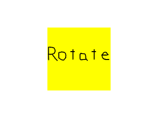

# Lazy Foo' Productions


# Multi Touch



In this tutorial we'll be using SDL 2's built in functionality to handle multi touch gestures like pinch and rotate.
```cpp
//Scene textures
LTexture gPinchCloseTexture;
LTexture gPinchOpenTexture;
LTexture gRotateTexture;
```
Like in the previous tutorial, we'll be using a set of textures to show which type of input is happening.
```cpp
            //Main loop flag
bool quit = false;
//Event handler
SDL_Event e;
//Touch variables
SDL_Point touchLocation = { gScreenRect.w / 2, gScreenRect.h / 2 };
LTexture* currentTexture = &gPinchOpenTexture;
```
Also like the previous tutorial, we'll need to keep track of the touch location and the current texture to render.
```cpp
                    //Multi touch gesture
else if( e.type == SDL_MULTIGESTURE )
{
//Rotation detected
if( fabs( e.mgesture.dTheta ) > 3.14 / 180.0 )
{
touchLocation.x = e.mgesture.x * gScreenRect.w;
touchLocation.y = e.mgesture.y * gScreenRect.h;
currentTexture = &gRotateTexture;
}
```
When a multi touch gesture happens a [SDL_MultiGestureEvent](https://wiki.libsdl.org/SDL_MultiGestureEvent) gets generated. Here we check for rotations first by checking the angle on the gesture. The thing to
remember is that the smallest rotation will get reported so if you pinch and rotate by a 1000th of a radian, it will show up in the gesture. Here we make sure the rotation is at least one degree before reporting it as a
rotation.

If the rotation is big enough, we set the location of the gesture and set the texture.
```cpp
                        //Pinch detected
else if( fabs( e.mgesture.dDist ) > 0.002 )
{
touchLocation.x = e.mgesture.x * gScreenRect.w;
touchLocation.y = e.mgesture.y * gScreenRect.h;
//Pinch open
if( e.mgesture.dDist > 0 )
{
currentTexture = &gPinchOpenTexture;
}
//Pinch close
else
{
currentTexture = &gPinchCloseTexture;
}
}
}
```
If the rotation wasn't big enough, we then check if the distance of the pinch. Again remember that coordinates are normalized so a 10 pixel pinch on a 1920 resolution tablet will be reported at around 0.0052.

If the pinch is big enough, we set the gesture position and then check if the pinch was opening or closing.
```cpp
                //Clear screen
SDL_SetRenderDrawColor( gRenderer, 0xFF, 0xFF, 0xFF, 0xFF );
SDL_RenderClear( gRenderer );
//Render touch texture
currentTexture->render( touchLocation.x - currentTexture->getWidth() / 2, touchLocation.y - currentTexture->getHeight() / 2 );
//Update screen
SDL_RenderPresent( gRenderer );
```
Once again like the previous tutorial, in the rendering we show the current gesture texture and the gesture position.

Download the media and source code for this tutorial [here](zip/55_multitouch.zip).
