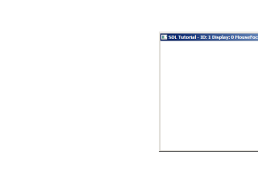
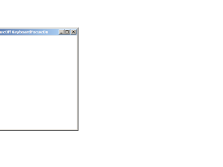

# Lazy Foo' Productions


# Multiple Displays





Another neat new feature with SDL 2 is the ability to handle multiple displays. Here we'll be making our window jump from display to display.
```cpp
class LWindow
{
public:
//Intializes internals
LWindow();
//Creates window
bool init();
//Handles window events
void handleEvent( SDL_Event& e );
//Focuses on window
void focus();
//Shows windows contents
void render();
//Deallocates internals
void free();
//Window dimensions
int getWidth();
int getHeight();
//Window focii
bool hasMouseFocus();
bool hasKeyboardFocus();
bool isMinimized();
bool isShown();
private:
//Window data
SDL_Window* mWindow;
SDL_Renderer* mRenderer;
int mWindowID;
int mWindowDisplayID;
//Window dimensions
int mWidth;
int mHeight;
//Window focus
bool mMouseFocus;
bool mKeyboardFocus;
bool mFullScreen;
bool mMinimized;
bool mShown;
};
```
Here is our window from previous tutorials with a window display ID to keep track of which display the window is on.
```cpp
//Our custom window
LWindow gWindow;
//Display data
int gTotalDisplays = 0;
SDL_Rect* gDisplayBounds = NULL;
```
Our displays all have a integer ID and a rectangle associated with them so we know the position and dimensions of each display on our desktop.
```cpp
bool LWindow::init()
{
//Create window
mWindow = SDL_CreateWindow( "SDL Tutorial", SDL_WINDOWPOS_UNDEFINED, SDL_WINDOWPOS_UNDEFINED, SCREEN_WIDTH, SCREEN_HEIGHT, SDL_WINDOW_SHOWN | SDL_WINDOW_RESIZABLE );
if( mWindow != NULL )
{
mMouseFocus = true;
mKeyboardFocus = true;
mWidth = SCREEN_WIDTH;
mHeight = SCREEN_HEIGHT;
//Create renderer for window
mRenderer = SDL_CreateRenderer( mWindow, -1, SDL_RENDERER_ACCELERATED | SDL_RENDERER_PRESENTVSYNC );
if( mRenderer == NULL )
{
printf( "Renderer could not be created! SDL Error: %sn", SDL_GetError() );
SDL_DestroyWindow( mWindow );
mWindow = NULL;
}
else
{
//Initialize renderer color
SDL_SetRenderDrawColor( mRenderer, 0xFF, 0xFF, 0xFF, 0xFF );
//Grab window identifiers
mWindowID = SDL_GetWindowID( mWindow );
mWindowDisplayID = SDL_GetWindowDisplayIndex( mWindow );
//Flag as opened
mShown = true;
}
}
else
{
printf( "Window could not be created! SDL Error: %sn", SDL_GetError() );
}
return mWindow != NULL && mRenderer != NULL;
}
```
Our window creation code is pretty much the same as before only now we made a call to
[SDL_GetWindowDisplayIndex](http://wiki.libsdl.org/SDL_GetWindowDisplayIndex) so we know which display the window was created on.
```cpp
void LWindow::handleEvent( SDL_Event& e )
{
//Caption update flag
bool updateCaption = false;
//If an event was detected for this window
if( e.type == SDL_WINDOWEVENT && e.window.windowID == mWindowID )
{
switch( e.window.event )
{
//Window moved
case SDL_WINDOWEVENT_MOVED:
mWindowDisplayID = SDL_GetWindowDisplayIndex( mWindow );
updateCaption = true;
break;
//Window appeared
case SDL_WINDOWEVENT_SHOWN:
mShown = true;
break;
//Window disappeared
case SDL_WINDOWEVENT_HIDDEN:
mShown = false;
break;
//Get new dimensions and repaint
case SDL_WINDOWEVENT_SIZE_CHANGED:
mWidth = e.window.data1;
mHeight = e.window.data2;
SDL_RenderPresent( mRenderer );
break;
//Repaint on expose
case SDL_WINDOWEVENT_EXPOSED:
SDL_RenderPresent( mRenderer );
break;
//Mouse enter
case SDL_WINDOWEVENT_ENTER:
mMouseFocus = true;
updateCaption = true;
break;
//Mouse exit
case SDL_WINDOWEVENT_LEAVE:
mMouseFocus = false;
updateCaption = true;
break;
//Keyboard focus gained
case SDL_WINDOWEVENT_FOCUS_GAINED:
mKeyboardFocus = true;
updateCaption = true;
break;
//Keyboard focus lost
case SDL_WINDOWEVENT_FOCUS_LOST:
mKeyboardFocus = false;
updateCaption = true;
break;
//Window minimized
case SDL_WINDOWEVENT_MINIMIZED:
mMinimized = true;
break;
//Window maxized
case SDL_WINDOWEVENT_MAXIMIZED:
mMinimized = false;
break;
//Window restored
case SDL_WINDOWEVENT_RESTORED:
mMinimized = false;
break;
//Hide on close
case SDL_WINDOWEVENT_CLOSE:
SDL_HideWindow( mWindow );
break;
}
}
```
Here in our window's event handler we handle a SDL_WINDOWEVENT_MOVED event so we can update the display the window is on using SDL_GetWindowDisplayIndex.
```cpp
    else if( e.type == SDL_KEYDOWN )
{
//Display change flag
bool switchDisplay = false;
//Cycle through displays on up/down
switch( e.key.keysym.sym )
{
case SDLK_UP:
++mWindowDisplayID;
switchDisplay = true;
break;
case SDLK_DOWN:
--mWindowDisplayID;
switchDisplay = true;
break;
}
```
When we press up or down we change the display index to move to the next display.
```cpp
        //Display needs to be updated
if( switchDisplay )
{
//Bound display index
if( mWindowDisplayID < 0 )
{
mWindowDisplayID = gTotalDisplays - 1;
}
else if( mWindowDisplayID >= gTotalDisplays )
{
mWindowDisplayID = 0;
}
//Move window to center of next display
SDL_SetWindowPosition( mWindow, gDisplayBounds[ mWindowDisplayID ].x + ( gDisplayBounds[ mWindowDisplayID ].w - mWidth ) / 2, gDisplayBounds[ mWindowDisplayID ].y + ( gDisplayBounds[ mWindowDisplayID ].h - mHeight ) / 2 );
updateCaption = true;
}
}
//Update window caption with new data
if( updateCaption )
{
std::stringstream caption;
caption << "SDL Tutorial - ID: " << mWindowID << " Display: " << mWindowDisplayID << " MouseFocus:" << ( ( mMouseFocus ) ? "On" : "Off" ) << " KeyboardFocus:" << ( ( mKeyboardFocus ) ? "On" : "Off" );
SDL_SetWindowTitle( mWindow, caption.str().c_str() );
}
}
```
If we need to move to the next display, we first make sure the display is a valid index by bounding it. We then update the position of the window with
[SDL_SetWindowPosition](http://wiki.libsdl.org/SDL_SetWindowPosition). This call here will center the window in the next display.
```cpp
bool init()
{
//Initialization flag
bool success = true;
//Initialize SDL
if( SDL_Init( SDL_INIT_VIDEO ) < 0 )
{
printf( "SDL could not initialize! SDL Error: %sn", SDL_GetError() );
success = false;
}
else
{
//Set texture filtering to linear
if( !SDL_SetHint( SDL_HINT_RENDER_SCALE_QUALITY, "1" ) )
{
printf( "Warning: Linear texture filtering not enabled!" );
}
//Get number of displays
gTotalDisplays = SDL_GetNumVideoDisplays();
if( gTotalDisplays < 2 )
{
printf( "Warning: Only one display connected!" );
}
```
In our initialization function we find out how many displays are connect to the computer using
[SDL_GetNumVideoDisplays](http://wiki.libsdl.org/SDL_GetNumVideoDisplays). If there's only 1 display we output a warning.
```cpp
        //Get bounds of each display
gDisplayBounds = new SDL_Rect[ gTotalDisplays ];
for( int i = 0; i < gTotalDisplays; ++i )
{
SDL_GetDisplayBounds( i, &gDisplayBounds[ i ] );
}
//Create window
if( !gWindow.init() )
{
printf( "Window could not be created!n" );
success = false;
}
}
return success;
}
```
Now that we know how many displays are connected, we allocate rectangles for each of them and get the bounds for each one using
[SDL_GetDisplayBounds](http://wiki.libsdl.org/SDL_GetDisplayBounds). After this we initialize our window.
```cpp
        //Main loop flag
bool quit = false;
//Event handler
SDL_Event e;
//While application is running
while( !quit )
{
//Handle events on queue
while( SDL_PollEvent( &e ) != 0 )
{
//User requests quit
if( e.type == SDL_QUIT )
{
quit = true;
}
//Handle window events
gWindow.handleEvent( e );
}
//Update window
gWindow.render();
}
```
Since our code is well encapsulated the main loop hasn't changed since all the changes have happened under the hood.

Download the media and source code for this tutorial [here](zip/37_multiple_displays.zip).
