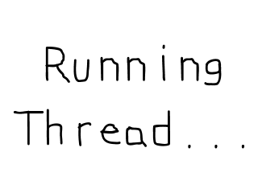

# Lazy Foo' Productions


# Multithreading




Multithreading can be used to make your program execute two things at once and take advantage of multithreaded architectures. Here we'll make a simple program that
outputs to the console while the main thread runs.

There is a saying in computer science:

## Premature optimization is the root of all evil

A major problem with newbie programmers is that they want to be like the professionals without paying their dues. They hear about a technology that the latest and greatest developers
out there are using and they think if the use it too it will make them magically better.

One of these tools is multithreading. Since multicore processors launched at a consumer level in the early 00s, developers have been using this new tech to squeeze out as much
performance as they can from their from their applications.

**Here's the important part:** a poorly made multithreaded program can perform worse than single thread program. Much worse. The fact is that multithreading inherently adds more
overhead because threads then have to be managed. If you do not know the costs of using different multithreading tools, you can end up with code that is much slower than its single
threaded equivalent.

The general rule is if you don't know:
*   What cache coherency is.
*   What cache alignment is.
*   How operating systems handle threads and processes.
*   How to use a profiler.

You should not be trying to use multithreaded optimization. Play with fire and you will get burned. However doing something not for the sake of performance like asynchronous file
loading isn't a bad idea for intermediate game developers.
```cpp
//Using SDL, SDL Threads, SDL_image, standard IO, and, strings
#include <SDL.h>
#include <SDL_thread.h>
#include <SDL_image.h>
#include <stdio.h>
#include <string>
```
When we want to use threads we need to make sure to include the SDL threads header.
```cpp
//Our test thread function
int threadFunction( void* data );
```
Just like with callback functions, thread functions need to declared a certain way. They need to take in a void pointer as an argument and return an integer.
```cpp
int threadFunction( void* data )
{
//Print incoming data
printf( "Running thread with value = %dn", (int)data );
return 0;
}
```
Our thread function is fairly simple. All it does is take in the data as an integer and uses it to print a message to the console.
```cpp
            //Run the thread
int data = 101;
SDL_Thread* threadID = SDL_CreateThread( threadFunction, "LazyThread", (void*)data );
//While application is running
while( !quit )
{
//Handle events on queue
while( SDL_PollEvent( &e ) != 0 )
{
//User requests quit
if( e.type == SDL_QUIT )
{
quit = true;
}
}
//Clear screen
SDL_SetRenderDrawColor( gRenderer, 0xFF, 0xFF, 0xFF, 0xFF );
SDL_RenderClear( gRenderer );
//Render prompt
gSplashTexture.render( 0, 0 );
//Update screen
SDL_RenderPresent( gRenderer );
}
//Remove timer in case the call back was not called
SDL_WaitThread( threadID, NULL );
```
Before we enter the main loop we run the thread function using [SDL_CreateThread](http://wiki.libsdl.org/SDL_CreateThread). This call will run the
function in first argument, give it the name in the second argument (names are used to identify it for debugging purposes), and passes in the data from the third argument.

The thread will then execute while the main thread is still going. In case the main loop ends before the thread finishes, we make a call to
[SDL_WaitThread](http://wiki.libsdl.org/SDL_WaitThread) to make sure the thread finishes before the application closes.

Download the media and source code for this tutorial [here](zip/46_multithreading.zip).
