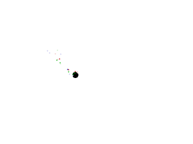

# Lazy Foo' Productions


# Particle Engines



Particles are just mini-animations. What we're going to do is take these animations:


and spawn them around a dot to create a trail of colored shimmering particles.
```cpp
//Particle count
const int TOTAL_PARTICLES = 20;
class Particle
{
public:
//Initialize position and animation
Particle( int x, int y );
//Shows the particle
void render();
//Checks if particle is dead
bool isDead();
private:
//Offsets
int mPosX, mPosY;
//Current frame of animation
int mFrame;
//Type of particle
LTexture *mTexture;
};
```
Here is a simple particle class. We have a constructor to set the position, a function to render it, and a function to tell if the particle is dead. In terms of data members we have
a position, a frame of animation, and a texture we'll render with.
```cpp
//The dot that will move around on the screen
class Dot
{
public:
//The dimensions of the dot
static const int DOT_WIDTH = 20;
static const int DOT_HEIGHT = 20;
//Maximum axis velocity of the dot
static const int DOT_VEL = 10;
//Initializes the variables and allocates particles
Dot();
//Deallocates particles
~Dot();
//Takes key presses and adjusts the dot's velocity
void handleEvent( SDL_Event& e );
//Moves the dot
void move();
//Shows the dot on the screen
void render();
private:
//The particles
Particle* particles[ TOTAL_PARTICLES ];
//Shows the particles
void renderParticles();
//The X and Y offsets of the dot
int mPosX, mPosY;
//The velocity of the dot
int mVelX, mVelY;
};
```
Here is our dot with an array of particles and a function to render the particles on the dot.
```cpp
Particle::Particle( int x, int y )
{
//Set offsets
mPosX = x - 5 + ( rand() % 25 );
mPosY = y - 5 + ( rand() % 25 );
//Initialize animation
mFrame = rand() % 5;
//Set type
switch( rand() % 3 )
{
case 0: mTexture = &gRedTexture; break;
case 1: mTexture = &gGreenTexture; break;
case 2: mTexture = &gBlueTexture; break;
}
}
```
For our particle constructor we initialize the position around the given position with some randomness to it. We then initialize the frame of animation with some randomness so the
particles will have varying life. Finally we pick the type of texture we'll use for the particle also at random.
```cpp
void Particle::render()
{
//Show image
mTexture->render( mPosX, mPosY );
//Show shimmer
if( mFrame % 2 == 0 )
{
gShimmerTexture.render( mPosX, mPosY );
}
//Animate
mFrame++;
}
```
In the rendering function we render our texture selected in the constructor and then every other frame we render a semitransparent shimmer texture over it to make it look like the
particle is shining. We then update the frame of animation.
```cpp
bool Particle::isDead()
{
return mFrame > 10;
}
```
Once the particle has rendered for a max of 10 frames, we mark it as dead.
```cpp
Dot::Dot()
{
//Initialize the offsets
mPosX = 0;
mPosY = 0;
//Initialize the velocity
mVelX = 0;
mVelY = 0;
//Initialize particles
for( int i = 0; i < TOTAL_PARTICLES; ++i )
{
particles[ i ] = new Particle( mPosX, mPosY );
}
}
Dot::~Dot()
{
//Delete particles
for( int i = 0; i < TOTAL_PARTICLES; ++i )
{
delete particles[ i ];
}
}
```
The constructor/destructor now have to allocate/deallocate the particles we render over the dot.
```cpp
void Dot::render()
{
//Show the dot
gDotTexture.render( mPosX, mPosY );
//Show particles on top of dot
renderParticles();
}
void Dot::renderParticles()
{
//Go through particles
for( int i = 0; i < TOTAL_PARTICLES; ++i )
{
//Delete and replace dead particles
if( particles[ i ]->isDead() )
{
delete particles[ i ];
particles[ i ] = new Particle( mPosX, mPosY );
}
}
//Show particles
for( int i = 0; i < TOTAL_PARTICLES; ++i )
{
particles[ i ]->render();
}
}
```
Our dot's rendering function now calls our particle rendering function. The particle rendering function checks if there is any particles that are dead and replaces them. After the
dead particles are replaced we render all the current particles to the screen.
```cpp
bool loadMedia()
{
//Loading success flag
bool success = true;
//Load dot texture
if( !gDotTexture.loadFromFile( "38_particle_engines/dot.bmp" ) )
{
printf( "Failed to load dot texture!n" );
success = false;
}
//Load red texture
if( !gRedTexture.loadFromFile( "38_particle_engines/red.bmp" ) )
{
printf( "Failed to load red texture!n" );
success = false;
}
//Load green texture
if( !gGreenTexture.loadFromFile( "38_particle_engines/green.bmp" ) )
{
printf( "Failed to load green texture!n" );
success = false;
}
//Load blue texture
if( !gBlueTexture.loadFromFile( "38_particle_engines/blue.bmp" ) )
{
printf( "Failed to load blue texture!n" );
success = false;
}
//Load shimmer texture
if( !gShimmerTexture.loadFromFile( "38_particle_engines/shimmer.bmp" ) )
{
printf( "Failed to load shimmer texture!n" );
success = false;
}
//Set texture transparency
gRedTexture.setAlpha( 192 );
gGreenTexture.setAlpha( 192 );
gBlueTexture.setAlpha( 192 );
gShimmerTexture.setAlpha( 192 );
return success;
}
```
To give our particles a semi transparent look we set their alpha to 192.
```cpp
            //Main loop flag
bool quit = false;
//Event handler
SDL_Event e;
//The dot that will be moving around on the screen
Dot dot;
//While application is running
while( !quit )
{
//Handle events on queue
while( SDL_PollEvent( &e ) != 0 )
{
//User requests quit
if( e.type == SDL_QUIT )
{
quit = true;
}
//Handle input for the dot
dot.handleEvent( e );
}
//Move the dot
dot.move();
//Clear screen
SDL_SetRenderDrawColor( gRenderer, 0xFF, 0xFF, 0xFF, 0xFF );
SDL_RenderClear( gRenderer );
//Render objects
dot.render();
//Update screen
SDL_RenderPresent( gRenderer );
}
```
Again, since our code is well encapsulated the code in the main loop hardly changes.

Now like most of the tutorials this is a super simplified example. In larger program there would be particles controlled by a particle emitter that's its own class, but for the sake
of simplicity we're having the Dot class function as a particle emitter.

Download the media and source code for this tutorial [here](zip/38_particle_engines.zip).
