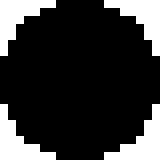
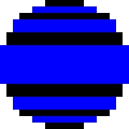
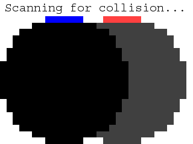
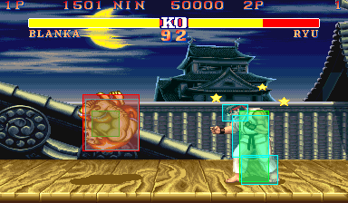

# Lazy Foo' Productions

# Per-pixel Collision Detection


Once you know how to [check collision between two rectangles](Collision_Detection.md), you can check collision between any two
images since all images are made out of rectangles.

Everything can be made out of rectangles in a video game, even this dot:


Don't see it? Let's zoom in:



Still don't see it? How about now:



Images are made out of pixels which are squares which are rectangles. To do per-pixel collision detection all we have to do is have each object have a set of box colliders and check
collision of one set of collision boxes against another like so:


```cpp
//The dot that will move around on the screen
class Dot
{
public:
//The dimensions of the dot
static const int DOT_WIDTH = 20;
static const int DOT_HEIGHT = 20;
//Maximum axis velocity of the dot
static const int DOT_VEL = 1;
//Initializes the variables
Dot( int x, int y );
//Takes key presses and adjusts the dot's velocity
void handleEvent( SDL_Event& e );
//Moves the dot and checks collision
void move( std::vector<SDL_Rect>& otherColliders );
//Shows the dot on the screen
void render();
//Gets the collision boxes
std::vector<SDL_Rect>& getColliders();
private:
//The X and Y offsets of the dot
int mPosX, mPosY;
//The velocity of the dot
int mVelX, mVelY;
//Dot's collision boxes
std::vector<SDL_Rect> mColliders;
//Moves the collision boxes relative to the dot's offset
void shiftColliders();
};
```
Here is our dot now with per-pixel collision detection. Its velocity is reduced to 1 pixel per frame to make the collision easier to see. The move function now takes in a vector
of collision boxes so we can check two sets against each other. Since we're going to have two dots colliding, we need to be able to get the colliders so we have a function for
that.

Instead of having a single collision box, we have a vector of colliders. We also have an internal function to shift the colliders to match the position of the dot.
```cpp
//Starts up SDL and creates window
bool init();
//Loads media
bool loadMedia();
//Frees media and shuts down SDL
void close();
//Box set collision detector
bool checkCollision( std::vector<sdl_rect>& a, std::vector<sdl_rect>& b );
</sdl_rect></sdl_rect>```
Here we have our new collision detector that checks sets of collision boxes against each other.
```cpp
Dot::Dot( int x, int y )
{
//Initialize the offsets
mPosX = x;
mPosY = y;
//Create the necessary SDL_Rects
mColliders.resize( 11 );
//Initialize the velocity
mVelX = 0;
mVelY = 0;
//Initialize the collision boxes' width and height
mColliders[ 0 ].w = 6;
mColliders[ 0 ].h = 1;
mColliders[ 1 ].w = 10;
mColliders[ 1 ].h = 1;
mColliders[ 2 ].w = 14;
mColliders[ 2 ].h = 1;
mColliders[ 3 ].w = 16;
mColliders[ 3 ].h = 2;
mColliders[ 4 ].w = 18;
mColliders[ 4 ].h = 2;
mColliders[ 5 ].w = 20;
mColliders[ 5 ].h = 6;
mColliders[ 6 ].w = 18;
mColliders[ 6 ].h = 2;
mColliders[ 7 ].w = 16;
mColliders[ 7 ].h = 2;
mColliders[ 8 ].w = 14;
mColliders[ 8 ].h = 1;
mColliders[ 9 ].w = 10;
mColliders[ 9 ].h = 1;
mColliders[ 10 ].w = 6;
mColliders[ 10 ].h = 1;
//Initialize colliders relative to position
shiftColliders();
}
```
Just like before, we have to set the collider dimensions in the constructor. Only difference here is that we have multiple collision boxes to set.
```cpp
void Dot::move( std::vector<SDL_Rect>& otherColliders )
{
//Move the dot left or right
mPosX += mVelX;
shiftColliders();
//If the dot collided or went too far to the left or right
if( ( mPosX < 0 ) || ( mPosX + DOT_WIDTH > SCREEN_WIDTH ) || checkCollision( mColliders, otherColliders ) )
{
//Move back
mPosX -= mVelX;
shiftColliders();
}
//Move the dot up or down
mPosY += mVelY;
shiftColliders();
//If the dot collided or went too far up or down
if( ( mPosY < 0 ) || ( mPosY + DOT_HEIGHT > SCREEN_HEIGHT ) || checkCollision( mColliders, otherColliders ) )
{
//Move back
mPosY -= mVelY;
shiftColliders();
}
}
```
This functions pretty much the same as before. Whenever we move the dot, we move the collider(s) with it. After we move the dot, we check if it went off screen or hit something. If
it did, we move the dot back and move its colliders with it.
```cpp
void Dot::shiftColliders()
{
//The row offset
int r = 0;
//Go through the dot's collision boxes
for( int set = 0; set < mColliders.size(); ++set )
{
//Center the collision box
mColliders[ set ].x = mPosX + ( DOT_WIDTH - mColliders[ set ].w ) / 2;
//Set the collision box at its row offset
mColliders[ set ].y = mPosY + r;
//Move the row offset down the height of the collision box
r += mColliders[ set ].h;
}
}
std::vector<sdl_rect>& Dot::getColliders()
{
return mColliders;
}
</sdl_rect>```
Don't worry too much about how shiftColliders works. It's a short hand way of mColliders[ 0 ].x = ..., mColliders[ 1 ].x = ..., etc and it works for this specific case. For your own
per-pixel objects you'll have your own placing functions.

And after shiftColliders, have an accessor function to get the colliders.
```cpp
bool checkCollision( std::vector<SDL_Rect>& a, std::vector<SDL_Rect>& b )
{
//The sides of the rectangles
int leftA, leftB;
int rightA, rightB;
int topA, topB;
int bottomA, bottomB;
//Go through the A boxes
for( int Abox = 0; Abox < a.size(); Abox++ )
{
//Calculate the sides of rect A
leftA = a[ Abox ].x;
rightA = a[ Abox ].x + a[ Abox ].w;
topA = a[ Abox ].y;
bottomA = a[ Abox ].y + a[ Abox ].h;
```
Here in our collision detection function, we have a for loop that calculates the top/bottom/left/right of each collision box in object a.
```cpp
        //Go through the B boxes
for( int Bbox = 0; Bbox < b.size(); Bbox++ )
{
//Calculate the sides of rect B
leftB = b[ Bbox ].x;
rightB = b[ Bbox ].x + b[ Bbox ].w;
topB = b[ Bbox ].y;
bottomB = b[ Bbox ].y + b[ Bbox ].h;
//If no sides from A are outside of B
if( ( ( bottomA <= topB ) || ( topA >= bottomB ) || ( rightA <= leftB ) || ( leftA >= rightB ) ) == false )
{
//A collision is detected
return true;
}
}
}
//If neither set of collision boxes touched
return false;
}
```
We then check calculate the top/bottom/left/right of each collision box in object b. We then check if there is no separating axis. If this no separating axis, we return true. If we
get through both sets without a collision, we return false.
```cpp
            //Main loop flag
bool quit = false;
//Event handler
SDL_Event e;
//The dot that will be moving around on the screen
Dot dot( 0, 0 );
//The dot that will be collided against
Dot otherDot( SCREEN_WIDTH / 4, SCREEN_HEIGHT / 4 );
```
Before we go into the main loop we declare our dot and the other dot we'll be colliding against.
```cpp
            //While application is running
while( !quit )
{
//Handle events on queue
while( SDL_PollEvent( &e ) != 0 )
{
//User requests quit
if( e.type == SDL_QUIT )
{
quit = true;
}
//Handle input for the dot
dot.handleEvent( e );
}
//Move the dot and check collision
dot.move( otherDot.getColliders() );
//Clear screen
SDL_SetRenderDrawColor( gRenderer, 0xFF, 0xFF, 0xFF, 0xFF );
SDL_RenderClear( gRenderer );
//Render dots
dot.render();
otherDot.render();
//Update screen
SDL_RenderPresent( gRenderer );
}
```
Once again in the main loop we handle events for the dot, move with collision check for the dot, and then finally we render our objects.

A questions I get asked a lot is how to make a function that loads an image and auto generates the set of collision boxes for per pixel collision detection. The answer is simple:

Don't.

In most games, you don't want 100% accuracy. The more collision boxes you have the more collision checks you have and the slower it is. What most games go for is close enough, like
in  Street Fighter:



The results are not pixel perfect but they are close enough.

Also there's one optimization we could have done here. We could have had a bounding box for the dot that encapsulates all the other collision boxes and then checks that one first
before getting to the per-pixel collison boxes. This does add one more collision detection, but since it is much more likely that two objects do not collide it will more likely save
us additional collision detection. In games, this is usually done with a tree structure that has different levels of detail to allow for early outs to prevent unneeded checks at the
per-pixel level. Like in previous tutorials, tree structures are outside the scope of these tutorials.

Download the media and source code for this tutorial [here](zip/28_per-pixel_collision_detection.zip).
