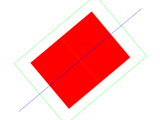

# Lazy Foo' Productions


# Render to Texture




For some effects being able to render a scene to texture is needed. Here we'll be rendering a scene to a texture to achieve a spinning scene effect.
```cpp
//Texture wrapper class
class LTexture
{
public:
//Initializes variables
LTexture();
//Deallocates memory
~LTexture();
//Loads image at specified path
bool loadFromFile( std::string path );
#ifdef _SDL_TTF_H
//Creates image from font string
bool loadFromRenderedText( std::string textureText, SDL_Color textColor );
#endif
//Creates blank texture
bool createBlank( int width, int height, SDL_TextureAccess = SDL_TEXTUREACCESS_STREAMING );
//Deallocates texture
void free();
//Set color modulation
void setColor( Uint8 red, Uint8 green, Uint8 blue );
//Set blending
void setBlendMode( SDL_BlendMode blending );
//Set alpha modulation
void setAlpha( Uint8 alpha );
//Renders texture at given point
void render( int x, int y, SDL_Rect* clip = NULL, double angle = 0.0, SDL_Point* center = NULL, SDL_RendererFlip flip = SDL_FLIP_NONE );
//Set self as render target
void setAsRenderTarget();
//Gets image dimensions
int getWidth();
int getHeight();
//Pixel manipulators
bool lockTexture();
bool unlockTexture();
void* getPixels();
void copyPixels( void* pixels );
int getPitch();
Uint32 getPixel32( unsigned int x, unsigned int y );
private:
//The actual hardware texture
SDL_Texture* mTexture;
void* mPixels;
int mPitch;
//Image dimensions
int mWidth;
int mHeight;
};
```
Here we are adding more functionality to the texture class. The createBlank function now takes in another argument that defines how it is accessed. We also have the setAsRenderTarget
function which makes it so we can render to this texture.
```cpp
bool LTexture::createBlank( int width, int height, SDL_TextureAccess access )
{
//Create uninitialized texture
mTexture = SDL_CreateTexture( gRenderer, SDL_PIXELFORMAT_RGBA8888, access, width, height );
if( mTexture == NULL )
{
printf( "Unable to create blank texture! SDL Error: %sn", SDL_GetError() );
}
else
{
mWidth = width;
mHeight = height;
}
return mTexture != NULL;
}
```
When we want to render to a texture we need to set its texture access to [SDL_TEXTUREACCESS_TARGET](http://wiki.libsdl.org/SDL_TextureAccess), which is
why this function takes an additional argument now.
```cpp
void LTexture::setAsRenderTarget()
{
//Make self render target
SDL_SetRenderTarget( gRenderer, mTexture );
}
```
To render to a texture we have to set it as the render target which is done here using a call to
[SDL_SetRenderTarget](http://wiki.libsdl.org/SDL_SetRenderTarget).
```cpp
bool loadMedia()
{
//Loading success flag
bool success = true;
//Load texture target
if( !gTargetTexture.createBlank( SCREEN_WIDTH, SCREEN_HEIGHT, SDL_TEXTUREACCESS_TARGET ) )
{
printf( "Failed to create target texture!n" );
success = false;
}
return success;
}
```
We create our target texture in the media loading function.
```cpp
            //Main loop flag
bool quit = false;
//Event handler
SDL_Event e;
//Rotation variables
double angle = 0;
SDL_Point screenCenter = { SCREEN_WIDTH / 2, SCREEN_HEIGHT / 2 };
```
For this demo we'll render some geometry to a texture and spin that texture around the center of the screen. This is why we have variables for angle of rotation and center of screen.
```cpp
            //While application is running
while( quit == false )
{
//Handle events on queue
while( SDL_PollEvent( &e ) != 0 )
{
//User requests quit
if( e.type == SDL_QUIT )
{
quit = true;
}
}
//rotate
angle += 2;
if( angle > 360 )
{
angle -= 360;
}
//Set self as render target
gTargetTexture.setAsRenderTarget();
//Clear screen
SDL_SetRenderDrawColor( gRenderer, 0xFF, 0xFF, 0xFF, 0xFF );
SDL_RenderClear( gRenderer );
//Render red filled quad
SDL_Rect fillRect = { SCREEN_WIDTH / 4, SCREEN_HEIGHT / 4, SCREEN_WIDTH / 2, SCREEN_HEIGHT / 2 };
SDL_SetRenderDrawColor( gRenderer, 0xFF, 0x00, 0x00, 0xFF );
SDL_RenderFillRect( gRenderer, &fillRect );
//Render green outlined quad
SDL_Rect outlineRect = { SCREEN_WIDTH / 6, SCREEN_HEIGHT / 6, SCREEN_WIDTH * 2 / 3, SCREEN_HEIGHT * 2 / 3 };
SDL_SetRenderDrawColor( gRenderer, 0x00, 0xFF, 0x00, 0xFF );
SDL_RenderDrawRect( gRenderer, &outlineRect );
//Draw blue horizontal line
SDL_SetRenderDrawColor( gRenderer, 0x00, 0x00, 0xFF, 0xFF );
SDL_RenderDrawLine( gRenderer, 0, SCREEN_HEIGHT / 2, SCREEN_WIDTH, SCREEN_HEIGHT / 2 );
//Draw vertical line of yellow dots
SDL_SetRenderDrawColor( gRenderer, 0xFF, 0xFF, 0x00, 0xFF );
for( int i = 0; i < SCREEN_HEIGHT; i += 4 )
{
SDL_RenderDrawPoint( gRenderer, SCREEN_WIDTH / 2, i );
}
//Reset render target
SDL_SetRenderTarget( gRenderer, NULL );
//Show rendered to texture
gTargetTexture.render( 0, 0, NULL, angle, &screenCenter );
//Update screen
SDL_RenderPresent( gRenderer );
}
```
In our main loop before we do any rendering we set the target texture as a target. We then render our scene full of geometry and once we're done rendering to a texture we call
SDL_SetRenderTarget with a NULL texture so any rendering done afterward will be done to the screen.

With our scene rendered to a texture, we then render the target texture to the screen at a rotated angle.

Download the media and source code for this tutorial [here](zip/43_render_to_texture.zip).
