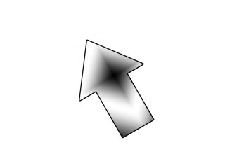

# Lazy Foo' Productions

# Rotation and Flipping



SDL 2's hardware accelerated texture rendering also gives ability to give us fast image flipping and rotation. In this tutorial we'll be using this to make an arrow
texture spin and flip.
```cpp
//Texture wrapper class
class LTexture
{
public:
//Initializes variables
LTexture();
//Deallocates memory
~LTexture();
//Loads image at specified path
bool loadFromFile( std::string path );
//Deallocates texture
void free();
//Set color modulation
void setColor( Uint8 red, Uint8 green, Uint8 blue );
//Set blending
void setBlendMode( SDL_BlendMode blending );
//Set alpha modulation
void setAlpha( Uint8 alpha );
//Renders texture at given point
void render( int x, int y, SDL_Rect* clip = NULL, double angle = 0.0, SDL_Point* center = NULL, SDL_RendererFlip flip = SDL_FLIP_NONE );
//Gets image dimensions
int getWidth();
int getHeight();
private:
//The actual hardware texture
SDL_Texture* mTexture;
//Image dimensions
int mWidth;
int mHeight;
};
```
Here we're adding more functionality to the [texture class](index-10.php.htm). The render function now takes in a rotation angle, a point to
rotate the texture around, and [a SDL flipping enum](http://wiki.libsdl.org/SDL_RendererFlip).

Like with clipping rectangles, we give the arguments default values in case you want to render the texture without rotation or flipping.
```cpp
void LTexture::render( int x, int y, SDL_Rect* clip, double angle, SDL_Point* center, SDL_RendererFlip flip )
{
//Set rendering space and render to screen
SDL_Rect renderQuad = { x, y, mWidth, mHeight };
//Set clip rendering dimensions
if( clip != NULL )
{
renderQuad.w = clip->w;
renderQuad.h = clip->h;
}
//Render to screen
SDL_RenderCopyEx( gRenderer, mTexture, clip, &renderQuad, angle, center, flip );
}
```
As you can see, all we're doing is passing in the arguments from our function to [SDL_RenderCopyEx](http://wiki.libsdl.org/SDL_RenderCopyEx). This function
works the same as the original SDL_RenderCopy, but with additional arguments for rotation and flipping.
```cpp
  //Main loop flag
bool quit = false;
//Event handler
SDL_Event e;
//Angle of rotation
double degrees = 0;
//Flip type
SDL_RendererFlip flipType = SDL_FLIP_NONE;
```
Before we enter the main loop we delare variables to keep track of the rotation angle and flipping type.
```cpp
        //Handle events on queue
while( SDL_PollEvent( &e ) != 0 )
{
//User requests quit
if( e.type == SDL_QUIT )
{
quit = true;
}
else if( e.type == SDL_KEYDOWN )
{
switch( e.key.keysym.sym )
{
case SDLK_a:
degrees -= 60;
break;
case SDLK_d:
degrees += 60;
break;
case SDLK_q:
flipType = SDL_FLIP_HORIZONTAL;
break;
case SDLK_w:
flipType = SDL_FLIP_NONE;
break;
case SDLK_e:
flipType = SDL_FLIP_VERTICAL;
break;
}
}
}
```
In the event loop, we want to increment/decrement the rotation with the a/d keys and change the type of flipping with the q,w, and e keys.
```cpp
          //Clear screen
SDL_SetRenderDrawColor( gRenderer, 0xFF, 0xFF, 0xFF, 0xFF );
SDL_RenderClear( gRenderer );
//Render arrow
gArrowTexture.render( ( SCREEN_WIDTH - gArrowTexture.getWidth() ) / 2, ( SCREEN_HEIGHT - gArrowTexture.getHeight() ) / 2, NULL, degrees, NULL, flipType );
//Update screen
SDL_RenderPresent( gRenderer );
```
Here we do the actual rendering. First we pass in the x and y coordinates. That may seem like a complicated equation, but all it does is center the image. If the image is 440 pixels
wide on a 640 pixel wide screen, we want it to be padded by 100 pixels on each side. In other words, the x coordinate will be the screen width (640) minus the image width (440) all
divided by 2 ( (640 - 440 ) / 2 = 100).

The next argument is the clip rectangle and since we're rendering the whole texture it is set to null. The next argument is the rotation angle in degrees. The next argument is the
point we're rotation around. When this is null, it will rotate around the center of the image. The last argument is how the image flipped.

The best way to wrap your mind around how to use rotation is to play around with it. Experiment to see the type of effects you get by combining different rotations/flipping.

Download the media and source code for this tutorial [here](zip/15_rotation_and_flipping.zip).
