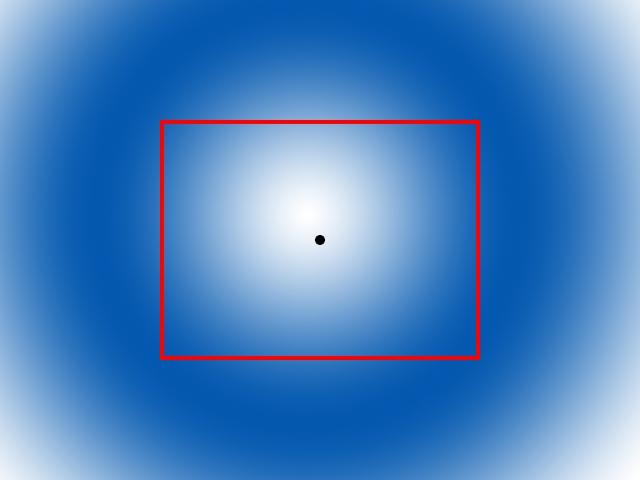
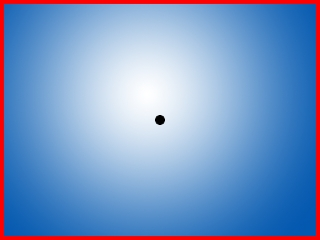

# Lazy Foo' Productions


# Scrolling


Up until now we've only been deal with levels the size of the screen. With scrolling you can navigate through levels of any size by rendering everything relative to a
camera.

The basic principle of scrolling is that you have a rectangle that functions as a camera:



And then you only render what's in the camera, which usually involves rendering things relative to the camera or only showing portions of objects inside the camera.


```cpp
//The dimensions of the level
const int LEVEL_WIDTH = 1280;
const int LEVEL_HEIGHT = 960;
//Screen dimension constants
const int SCREEN_WIDTH = 640;
const int SCREEN_HEIGHT = 480;
```
Since the level is no longer the size of the screen we have to have a separate set of constants to define the level size.
```cpp
//The dot that will move around on the screen
class Dot
{
public:
//The dimensions of the dot
static const int DOT_WIDTH = 20;
static const int DOT_HEIGHT = 20;
//Maximum axis velocity of the dot
static const int DOT_VEL = 10;
//Initializes the variables
Dot();
//Takes key presses and adjusts the dot's velocity
void handleEvent( SDL_Event& e );
//Moves the dot
void move();
//Shows the dot on the screen relative to the camera
void render( int camX, int camY );
//Position accessors
int getPosX();
int getPosY();
private:
//The X and Y offsets of the dot
int mPosX, mPosY;
//The velocity of the dot
int mVelX, mVelY;
};
```
This time the dot has to render relative to the camera, so its rendering function takes in a camera position.
```cpp
void Dot::move()
{
//Move the dot left or right
mPosX += mVelX;
//If the dot went too far to the left or right
if( ( mPosX < 0 ) || ( mPosX + DOT_WIDTH > LEVEL_WIDTH ) )
{
//Move back
mPosX -= mVelX;
}
//Move the dot up or down
mPosY += mVelY;
//If the dot went too far up or down
if( ( mPosY < 0 ) || ( mPosY + DOT_HEIGHT > LEVEL_HEIGHT ) )
{
//Move back
mPosY -= mVelY;
}
}
```
This time when moving the dot, we check if the dot moved off the level as opposed to checking if it moved off the screen since the screen is going to move around the level.
```cpp
void Dot::render( int camX, int camY )
{
//Show the dot relative to the camera
gDotTexture.render( mPosX - camX, mPosY - camY );
}
```
Now when we render objects to the screen, we render them relative to the camera by subtracting the camera offset.
```cpp
            //Main loop flag
bool quit = false;
//Event handler
SDL_Event e;
//The dot that will be moving around on the screen
Dot dot;
//The camera area
SDL_Rect camera = { 0, 0, SCREEN_WIDTH, SCREEN_HEIGHT };
```
Before we go into the main loop, we declare the dot and the camera that is going to be following it.
```cpp
                //Move the dot
dot.move();
//Center the camera over the dot
camera.x = ( dot.getPosX() + Dot::DOT_WIDTH / 2 ) - SCREEN_WIDTH / 2;
camera.y = ( dot.getPosY() + Dot::DOT_HEIGHT / 2 ) - SCREEN_HEIGHT / 2;
//Keep the camera in bounds
if( camera.x < 0 )
{
camera.x = 0;
}
if( camera.y < 0 )
{
camera.y = 0;
}
if( camera.x > LEVEL_WIDTH - camera.w )
{
camera.x = LEVEL_WIDTH - camera.w;
}
if( camera.y > LEVEL_HEIGHT - camera.h )
{
camera.y = LEVEL_HEIGHT - camera.h;
}
```
After we move the dot, we want to change the camera position to center over it. We don't want the camera to go outside of the level so we keep it in bounds after moving it.
```cpp
                //Clear screen
SDL_SetRenderDrawColor( gRenderer, 0xFF, 0xFF, 0xFF, 0xFF );
SDL_RenderClear( gRenderer );
//Render background
gBGTexture.render( 0, 0, &camera );
//Render objects
dot.render( camera.x, camera.y );
//Update screen
SDL_RenderPresent( gRenderer );
```
After the camera is in place we render the portion of the background that is inside that camera and then render the dot relative to the camera position.

Download the media and source code for this tutorial [here](zip/30_scrolling.zip).
