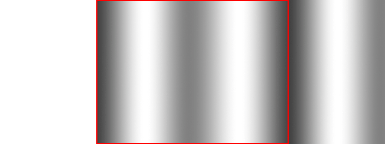

# Lazy Foo' Productions


# Scrolling Backgrounds


Often times in games you may want a infinite or looping background. With scrolling backgrounds, you can cycle a background that goes on forever.

Say if we want to move around a dot an a infinite background:


All we have to do is render two iterations of the background next to each other and move them a little every frame. When the background have moved completely over, you can reset the
motion:


```cpp
//The dot that will move around on the screen
class Dot
{
public:
//The dimensions of the dot
static const int DOT_WIDTH = 20;
static const int DOT_HEIGHT = 20;
//Maximum axis velocity of the dot
static const int DOT_VEL = 10;
//Initializes the variables
Dot();
//Takes key presses and adjusts the dot's velocity
void handleEvent( SDL_Event& e );
//Moves the dot
void move();
//Shows the dot on the screen
void render();
private:
//The X and Y offsets of the dot
int mPosX, mPosY;
//The velocity of the dot
int mVelX, mVelY;
};
```
For this tutorial we'll be using a plain version of the dot that just stays on screen.
```cpp
            //The dot that will be moving around on the screen
Dot dot;
//The background scrolling offset
int scrollingOffset = 0;
```
Before we enter the main loop we declare a Dot object and the scrolling offset.
```cpp
                //Move the dot
dot.move();
//Scroll background
--scrollingOffset;
if( scrollingOffset < -gBGTexture.getWidth() )
{
scrollingOffset = 0;
}
```
Here we're updating the dot and updating the scrolling background.

Updating the position of the scrolling background is just decrementing the x position and if the x position is less than the width of the background that means the background has
gone completely off screen and the position needs to be reset.
```cpp
                //Clear screen
SDL_SetRenderDrawColor( gRenderer, 0xFF, 0xFF, 0xFF, 0xFF );
SDL_RenderClear( gRenderer );
//Render background
gBGTexture.render( scrollingOffset, 0 );
gBGTexture.render( scrollingOffset + gBGTexture.getWidth(), 0 );
//Render objects
dot.render();
//Update screen
SDL_RenderPresent( gRenderer );
```
Here we're rendering the background and the dot. First we render the scrolling background by rendering two iterations of the texture next to each other and then we render the dot
over it. This will give us the effect of a smooth scrolling infinite background.

Download the media and source code for this tutorial [here](zip/31_scrolling_backgrounds.zip).
