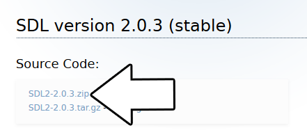
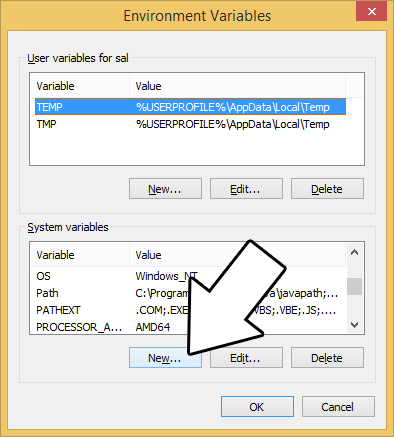
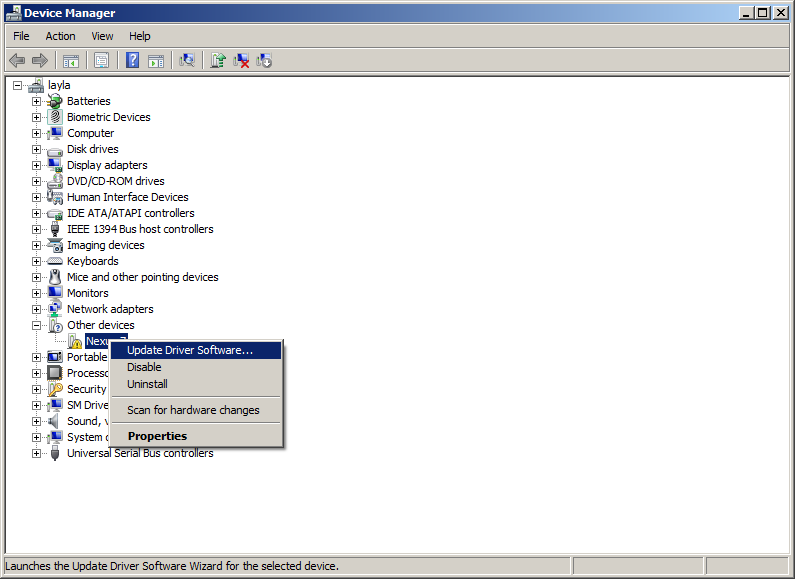

# Lazy Foo' Productions

# Setting up SDL 2 on Windows Android


Disclaimer: I am not a professional Android developer, so my knowledge of Android is limited to doing some porting of SDL apps to Android. Unfortunately, most the documentation for Android/SDL assumes you're proficient
with the Android SDK and NDK. I may not be an expert with Android, but I can bridge the gap between SDL desktop development and SDL Android development.

[1)](#1) Get ready to download. A lot. Like around 1 gigabyte of data. If you have a limited connection, I'm sorry the android SDK is huge and it's just the way things are.
I recommend having a movie or TV show to watch ready if a gigabyte takes a long time for you to download.

First, download the Java Development Kit (JDK) on [this page](http://www.oracle.com/technetwork/java/javase/downloads/jdk8-downloads-2133151.html). I am assuming you're running 64bit
windows, so download the 64bit version:


[2)](#2) Download the Android NDK on [this page](https://developer.android.com/tools/sdk/ndk/index.html). Again, I am assuming you're running 64bit
windows, so download the 64bit version:


[3)](#3) Download Apache Ant on [this page](http://ant.apache.org/bindownload.cgi).


[4)](#4) Download the SDL2 source. Not just the development libraries you use for desktop development, the full source. You can find the full source on[this page](https://www.libsdl.org/download-2.0.php).



[5)](#5) Download the Android SDK Manager on [this page](https://developer.android.com/sdk/index.html). We're not going to use the installer. We justwant the SDK Manager files by themselves.


[6)](#6) Install the JDK. This should be a simple next, next, next,... finish installation.

[7)](#7) Create a folder to serve as your Android development directory. For this tutorial we will create C:androiddevdir as our development directory.

After you have created your development directory, extract the NDK (it's going to take a while), Apache Ant, the SDL2 source, and the Android SDK manager. After you extract everything, you should have the following
directories in your Android development directory:

*   C:androiddevdirandroid-ndk-r10d
*   C:androiddevdirapache-ant-1.9.4
*   C:androiddevdirandroid-sdk-windows
*   C:androiddevdirSDL2-2.0.3

The version numbers might be a bit different like "C:androiddevdirSDL2-2.0.4" or "C:androiddevdirapache-ant-1.9.6", which is ok. What matters is that the Android NDK, Apache Ant, Android SDK, and the SDL2 source are in this folder where you can find them.

[8)](#8) With everything extracted, go into C:androiddevdirandroid-sdk-windows and run SDK Manager.exe. The SDK Manager will download the Android SDK tools we need. Yes, we still have more stuff to download.

You may be tempted to download the latest version, but I recommend against that. Later versions aren't as stable as the earlier versions and I would only get them if you actually need the features unique to them. I recommend getting the first stable release after API 12, which in this case is API 15.


Under the tools section, check "Android SDK Tools",  "Android SDK Platform Tools", and "Android SDK Build-Tools":


Under API 15, check "SDK Platform", and all the system images (especially ARM and Intel):


In the extras section, check "Google USB Driver":


You can download more than this, but keep in mind it can take hours more depending on your connection.

[8)](#8) Now that you have everything downloaded, it's time to configure your PC to find the programs it needs to build Android apps. We do this by setting the PATH environment variable which controls where Windows looks for executables. Open up the system menu either by A) right clicking My Computer and selecting Properties or B) going to the Control Panel and selecting the system menu. Once your in the system menu, click advanced system settings.


and then click environment variables


Under system variables, select the "Path" variable and click edit.


What we want to do is whenever we run the ndk-build, ant, or adb commands, the OS should look where ndk-build.cmd, ant.bat, or adb.exe is located. If you set up C:androiddevdir like we did in this tutorial, they should be at:

*   ndk-build.cmd - C:androiddevdirandroid-ndk-r10d
*   ant.bat - C:androiddevdirapache-ant-1.9.4bin
*   adb.exe - C:androiddevdirandroid-sdk-windowsplatform-tools

**You'll probably be using a more recent version of these tools which means their paths will be slightly different. Double check the paths** by finding ndk-build.cmd, ant.bat, and adb.exe. Once you find where these programs are, append their locations to the path.


Each location should be separated by a semicolon. If you put in this:
```bash
 "C:androiddevdirandroid-ndk-r10d C:androiddevdirapache-ant-1.9.4bin C:androiddevdirandroid-sdk-windowsplatform-tools"
```
it will not work.

Make sure there are no extra spaces between the paths. If you put in this:
```bash
"C:androiddevdirandroid-ndk-r10d ;C:androiddevdirapache-ant-1.9.4bin; C:androiddevdirandroid-sdk-windowsplatform-tools;"
```
It will not work.

After you appended the paths to ndk-build.cmd, ant.bat, and adb.exe, hit ok. It is also recommended that you close out all the Windows explorer windows and command line prompts. Any new window you start should now have the updated path variable.

[9)](#9) Now it's time to test that we set the paths correctly. Open up C:androiddevdir in windows explorer and hold shift while right clicking. This will bring up a menu with addition option "Open command window here". This will let you open a command prompt in the current directory.


Test ndk-build by typing in "ndk-build" and hitting enter. If you did it right you should get the following error:
```bash
 Android NDK: Could not find application project directory !
Android NDK: Please define the NDK_PROJECT_PATH variable to point to it.
C:androiddevdirandroid-ndk-r10dbuild/core/build-local.mk:148: *** Android NDK: Aborting    .  Stop.
```
If you did it wrong you'll get this error:
```bash
 'ndk-build' is not recognized as an internal or external command,
operable program or batch file.
```
Test ant by typing in "ant debug" and hitting enter. If you did it right you should get the following error:
```bash
Unable to locate tools.jar. Expected to find it in C:Program FilesJavajre1.8.0_45libtools.jar
Buildfile: build.xml does not exist!
Build failed
```
If you did it wrong you'll get this error:
```bash
 'ant' is not recognized as an internal or external command,
operable program or batch file.
```
Test adb by typing in "adb help" and hitting enter. If you did it right you should get a large help prompt or it will try to connect to a Android device. If it tries that, hit ctrl+c to exit the program.

If you did it wrong you'll get this error:
```bash
 'adb' is not recognized as an internal or external command,
operable program or batch file.
```
[10)](#10) After the path is set up, we need to set up the JAVA_HOME environment variable so Ant can use the Java development tools. Go back to the environment variables and click new instead of edit.



Set the variable name to the JDK directory which contains folders like "bin", "jre", etc. For the current version of the JDK it's located at C:Program FilesJavajdk1.8.0_45, but depending on your version it'll have a different folder name depending on the version your have.


Make sure the folder's name starts with "jdk" and not "jre" because that's the Java Runtime Environment. You need to path to the Java Development Kit.

[11)](#11) Test the JAVA_HOME set up by entering "ant debug" into the console from your Android development directory. If you set it up right you should get the following error:
```bash
 Buildfile: build.xml does not exist!
Build failed
```
If you set it up wrong you'll get this error:
```bash
Bad Error:
Unable to locate tools.jar. Expected to find it in C:Program FilesJavajre1.8.0_45libtools.jar
Buildfile: build.xml does not exist!
Build failed
```
[12)](#12) Next, we need to set up the ANDROID_HOME environment variable so Ant can build Android packages. Add a new environment variable with the name ANDROID_HOME and it should point to the directory that contains SDK Manager.exe. In this set up it should be C:androiddevdirandroid-sdk-windows

[13)](#13) Go to the Android project directory in the SDL source folder we extracted. It should be located at C:androiddevdirSDL2-2.0.3android-project. Open a command prompt in the directory and enter "ant debug". If you set up ANDROID_HOME correctly you should get the following error:
```bash
 BUILD FAILED
C:androiddevdirandroid-sdk-windowstoolsantbuild.xml:542: Unable to resolve project target 'android-12'
Total time: 0 seconds
```
If you didn't set it up properly, you'll get:
```bash
Buildfile: C:androiddevdirSDL2-2.0.3android-projectbuild.xml
BUILD FAILED
C:androiddevdirSDL2-2.0.3android-projectbuild.xml:56: sdk.dir is missing. Make sure to generate local.properties using 'android update project' or to inject it through the ANDROID_HOME environment
variable.
Total time: 1 second
```
[14)](#14) This part is technically optional but highly recommended. See, you can test on your Android device or the emulator. The emulator sucks, so you're going to want to use your Android device. First you'll need to enable USB debugging on your device. That is version specific which is why I won't go over it here. Google search "android enable usb debugging" with your device name and they'll show you how to do it.

Now that your device connected and debugging is enabled, open up the device manager.


Find your Android device and right click to update its driver.



Select browse for driver


And set it to the usb_driver folder in the SDK directory. For our set up it should be at C:androiddevdirandroid-sdk-windowsextrasgoogleusb_driver


[15)](#15) With our Android environment set up, it's time to get started. Go to the Android project directory inside of the SDL2 source folder
(C:androiddevdirSDL2-2.0.3android-project), open up a command prompt and ndk-build. You should get the following error:
```bash
 Android NDK: WARNING: APP_PLATFORM android-12 is larger than android:minSdkVersion 10 in ./AndroidManifest.xml
make.exe: *** No rule to make target `jni/src/../SDL/src/main/android/SDL_android_main.c', needed by `obj/local/armeabi/objs/main/__/SDL/src/main/android/SDL_android_main.o'.  Stop.
```
We'll get rid of that error in a second but for now let's fix the warning. Open up AndroidManifest.xml in the project directory and change
```bash
<uses-sdk android:minSdkVersion="10" android:targetSdkVersion="12" />
```
to
```bash
 <uses-sdk android:minSdkVersion="15" android:targetSdkVersion="15" />
```
Run ndk-build one more time in the project directory and you'll get the error without the warning:
```bash
 make.exe: *** No rule to make target `jni/src/../SDL/src/main/android/SDL_android_main.c', needed by `obj/local/armeabi/objs/main/__/SDL/src/main/android/SDL_android_main.o'.  Stop.
```
[16)](#16) In this case, the error "No rule to make target" actually means it can't find the file you're asking to compile. So what's actually going on is that the ndk is trying to
build SDL_android_main.c but it can't find it at C:androiddevdirSDL2-2.0.3android-projectjni/src/../SDL/src/main/android/SDL_android_main.c.

Let's back up a bit and talk about how SDL 2 on Android works. Android development is mostly Java based and SDL is a C based library. The **N**ative **D**evelopment **K**it that allows Java to interface with
native C/C++ code using the **J**ava **N**ative **I**nterface. With the NDK, we'll build SDL2 as a **s**hared **o**bject that will interface with Java, and we'll build our game as another shared object
that will interface with SDL 2.

In the android project directory there's a jni directory that will contain our native C/C++ code. Create a directory called SDL2 inside of the JNI directory. In this directory we will put the source, includes, and
Android makefile for the SDL library. Copy src, include, and Android.mk from C:androiddevdirSDL2-2.0.3 and paste them inside of C:androiddevdirSDL2-2.0.3android-projectjniSDL2.

From the project directory run ndk-build. SDL should compile and install but you'll still get an error.

[17)](#17) The error:
```bash
 make.exe: *** No rule to make target `jni/src/../SDL/src/main/android/SDL_android_main.c', needed by `obj/local/armeabi/objs/main/__/SDL/src/main/android/SDL_android_main.o'.  Stop.
```
Still means it can't find SDL_android_main.c, but this is part of our game compiling. We need to put our game source in the jni/src folder. Download the
[source for lesson 52](52_hello_mobile.zip) and place 52_hello_mobile.cpp at jni/src/52_hello_mobile.cpp.

Next open up the makefile for the game source at jni/src/Android.mk. Change
```bash
SDL_PATH := ../SDL
```
to
```bash
 SDL_PATH := ../SDL2
```
If you still get "No rule to make target" for SDL_android_main.c it means you messed up this part.

In Android.mk there should also be a section like this:
```bash
 LOCAL_SRC_FILES := $(SDL_PATH)/src/main/android/SDL_android_main.c 	YourSourceHere.c
```
Change YourSourceHere.c to 52_hello_mobile.cpp so it compiles our source.

Run ndk-build from the project directory and you should get a new error:
```bash
jni/src/52_hello_mobile.cpp:7:18: fatal error: string: No such file or directory
#include <string>
^
compilation terminated.
make.exe: *** [obj/local/armeabi/objs/main/52_hello_mobile.o] Error 1
```
[18)](#18) That previous error is because this project is not set to use the C++ standard library, which is why it can't find the string header. To enable STL, open up
jniApplication.mk and uncomment "APP_STL := stlport_static". Run ndk-build from the project directory. The SDL 2 library and our source should build the native binary.

[19)](#19) With SDL 2 and our SDL application libraries built, it's time to interface it with Java. First we need to configure Ant to use API 15\. In the project directory there
should be ant.properties. Open it and add the line
```bash
 target=android-15
```
so Ant uses API 15\. from the project directory run ant debug. It will say build successful but **THE GAME WILL NOT RUN**. Be extra careful beyond this point because there aren't many useful error messages.
The application will just stop working.

[20)](#20) Our project will build but not run at this point because we still need to interface the native code with Java, and it can't detect errors with that until it runs. First
create a folder called com in the project folder's src directory. **NOT the JNI source directory at android-projectjnisrc**, but the Java source directory at android-projectsrc. Inside of that folder, create
another folder called tutorial. Inside that folder create a folder called game. You should now have a folder with the path android-projectsrccomtutorialgame.

Download a premade [Java file](HelloSDL2Activity.java) designed to interface with SDL and place it at android-projectsrccomtutorialgameHelloSDL2Activity.java.

The contents of this source file are simple.
```cpp
package com.tutorial.game;
import org.libsdl.app.SDLActivity;
public class HelloSDL2Activity extends SDLActivity
{
}
```
All it does is create another class from the SDLActivity class which takes care of all the interfacing with SDL for us. Notice how the package name has to match the directory structure we created.

[21)](#21) Open AndroidManifest.xml. Change
```
 package="org.libsdl.app"
```
to
```
 package="com.tutorial.game"
```
and
```
android:name="SDLActivity"
```
to
```
android:name="HelloSDL2Activity"
```
Now the Android app will use our package and run our activity.

[22)](#22) Open C:androiddevdirSDL2-2.0.3android-projectresvaluesstrings.xml and change
```
<string name="app_name">SDL App</string>
```
to
```
<string name="app_name">SDL Tutorial</string>
```
This will change the name under the App's icon from SDL App to SDL Tutorial.

[23)](#23) At this point the app will run our code but it will fail because it can't load the media files for the tutorial. Media files go in the asset directory. Create a folder called
"assets" in the project folder. Copy the directory inside of the zip we downloaded and place it in the assets directory. If the application needs to open "52_hello_mobilehello.bmp", it needs to be at
android-projectassets52_hello_mobilehello.bmp when building.

[24)](#24) Our SDL application is ready to build and run. Inside of the project directory, run "ant debug install". The application should build and install on your Android
device. Search for it in your apps and run it. If the image is small it's because it's only 128x128 so it can fit the smallest Android device.

[25)](#25) If you want to get console output from your Android application, you'll have to use logcat with the **A**ndroid **D**e**b**ugger. With your device Android
connected, run "adb logcat". You'll see all the things outputting to the console. When you first run it you'll get a flood of messages but after the initial flood you should see anything you write to the console.
You can quit logcat with ctrl+c.

Now that you have SDL 2 running on your device, it's time to go onto part 2 of the tutorial. Note: if you change the orientation of your Android device, the application will crash. We will deal with how to fix that
in the next tutorial.
[Hello Mobile Part 2: Your First Mobile SDL 2 App](index2-2.php.htm)
