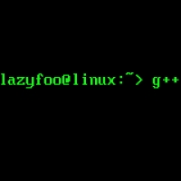

# Lazy Foo' Productions


# Setting up SDL 2 on Linux


Since there are so many flavors of Linux these tutorials might not work on your Linux set up. If you've tried everything and are still having problems, [contact me](http://lazyfoo.net/contact.php) and I'll try to add on a distro specific fix.

In the age of packaging managers, a lot of the work is done for you when installing libraries. You'll need root privileges to install packages so make sure to use "su" or "sudo" if you're not logged in as root.

Make sure you have updated to the latest version of your distro because your older package manager may not support the latest version of SDL 2.

##### 1)
For those of you who have Advanced Packaging Tool available (ie Ubuntu and Debian) you'll want to search the apt-get cache to find the current SDL 2 version to install. You can search the apt-get available packages using the command:
```bash
apt-cache search libsdl2
```
You'll want to download the development version of SDL 2\. As of the last update of this tutorial, the development package of SDL 2 is **libsdl2-dev**. You can install this package using the command
```bash
apt-get install libsdl2-dev
```
##### 2)
If you use the Yellow dog Updater, Modified (used in Fedora and CentOS) you can enter the command:
```cpp
yum search SDL2-devel
```
To search for the SDL 2 developers package. As of the last update of this tutorial, the developer package for SDL 2 is **SDL2-devel**. You can install this package using the command:
```cpp
 yum install SDL2-devel
```

##### 3)
If somehow you don't have a package manager, you can install from the source the classic Unix way. Download the latest source from the
[SDL website](http://www.libsdl.org/download-2.0.php#source).


Extract the archive and cd to the folder that got extracted. Configure the installation using
```cpp
 ./configure
```
Compile the source using the make command
```cpp
make all
```
Finally, install the package using the make command
```cpp
make install
```
Note: If you do a manual install you may have to specify where the headers and library files are for your compiler/IDE.

#####4)
Now that you've installed the development libraries, it's time to start up your IDE/compiler.
Select Your IDE/Compile

|icon|IDE/Compile|
|----|:----------:|
|[](Setting_up_SDL_2_on_g++.md)|[Command Line](Setting_up_SDL_2_on_g++.md)|
|[](index-70.php.htm)|[Code::Blocks](index-70.php.htm)|

 [Back](index.md)
