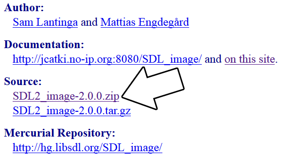

# Lazy Foo' Productions


# Setting up SDL_image on Mac Android

[1)](#1) First, download the SDL_image source on [this page](https://www.libsdl.org/projects/SDL_image/).



[2)](#2) Download the [demo source/assets](zip/53_extensions_and_changing_orientation.zip). Copy the directory to android-project/assets. Remember: if the
application needs to load "53_extensions_and_changing_orientation/portrait.png" it needs to be at "android-project/assets/53_extensions_and_changing_orientation/portrait.png" when building.

[3)](#3) Copy demo source to android-project/jni/53_extensions_and_changing_orientation.cpp. Open the game make file at android-project/jni/src/Android.mk. Change local source files
to include the new demo source file:
```bash
##### LOCAL_SRC_FILES := $(SDL_PATH)/src/main/android/SDL_android_main.c 53_extensions_and_changing_orientation.cpp
```
Run ndk-build. You'll get the error:
```bash
##### jni/src/53_extensions_and_changing_orientation.cpp:6:23: fatal error: SDL_image.h: No such file or directory
#include <SDL_image.h>
^
compilation terminated.
```
This error means that our game source file can't find SDL_image.h which makes sense since we haven't set it up yet.

[4)](#4) SDL_image is just another shared object library that needs to be built along SDL2 and our C++ application. So that means we need to create a folder for it at
android-project/jni/SDL2_image. After you create the folder the extension library, extract the SDL_image source. Inside of the SDL2_image-2.0.0 directory there should be some *.h header files, *.c source files,
and an Android.mk folder. Copy all the header/source files along with the Android.mk file and paste them in android-project/jni/SDL2_image.

With SDL_image in the jni directory along with SDL2 and our C++ source, run ndk-build. You'll get the following error:
```bash
##### jni/SDL2_image/IMG_jpg.c:34:21: fatal error: jpeglib.h: No such file or directory
#include <jpeglib.h>
^
compilation terminated.
```
[5)](#5) The error you just got is the NDK complaining it can't find the jpeglib library. See, SDL_image has libraries it needs to run and they need to be compiled as a shared
object with SDL2, SDL_image, and our C++ source. Go back into the SDL_image directory we extracted and there should be a folder called external. Inside of there there should be a bunch a folders containing header,
source, and Android makefiles for the external libraries used by SDL_image. Copy all the folders located at SDL2_image-2.0.0/external and paste them to android-project/jni so they can be compiled along SDL2,
SDL2_image, and our source.

SDL_image will probably have (version numbers may be different and new libraries may be added/removed):

*   zlib-1.2.8
*   jpeg-9
*   libpng-1.6.2
*   libwebp-0.3.0
*   tiff-4.0.3

SDL_mixer will have:

*   libmikmod-patches
*   libmodplug-0.8.8.4
*   libogg-1.3.1
*   libvorbis-1.3.3
*   libvorbisidec-1.2.1
*   smpeg2-2.0.0
*   flac-1.2.1
*   libmikmod-3.1.12

SDL_ttf will have:

*   freetype-2.4.12

If you run ndk-build you'll get the same error as before because we still need to set up SDL_image to find the header files for the external libraries. Open
android-project/jni/SDL2_image/Android.mk and find the section that sets the external library paths.
```bash
# Enable this if you want to support loading JPEG images
# The library path should be a relative path to this directory.
SUPPORT_JPG := true
JPG_LIBRARY_PATH := external/jpeg-9
# Enable this if you want to support loading PNG images
# The library path should be a relative path to this directory.
SUPPORT_PNG := true
PNG_LIBRARY_PATH := external/libpng-1.6.2
# Enable this if you want to support loading WebP images
# The library path should be a relative path to this directory.
SUPPORT_WEBP := true
WEBP_LIBRARY_PATH := external/libwebp-0.3.0
```
Change the paths to point to their folders in the android-project/jni/ directory.
```bash
# Enable this if you want to support loading JPEG images
# The library path should be a relative path to this directory.
SUPPORT_JPG := true
JPG_LIBRARY_PATH := ../jpeg-9
# Enable this if you want to support loading PNG images
# The library path should be a relative path to this directory.
SUPPORT_PNG := true
PNG_LIBRARY_PATH := ../libpng-1.6.2
# Enable this if you want to support loading WebP images
# The library path should be a relative path to this directory.
SUPPORT_WEBP := true
WEBP_LIBRARY_PATH := ../libwebp-0.3.0
```
Run ndk-build. SDL_image should build but we should get an old error:
```bash
##### jni/src/53_extensions_and_changing_orientation.cpp:6:23: fatal error: SDL_image.h: No such file or directory
#include <SDL_image.h>
^
compilation terminated.
```
[6)](#6) We managed to get the extension library to build but our application need to be able find the headers for SDL_image. Open android-project/jni/src/Android.mk and add in the path to
the includes so our game source can find the includes for SDL_image:
```bash
##### LOCAL_C_INCLUDES := $(LOCAL_PATH)/$(SDL_PATH)/include $(LOCAL_PATH)/../SDL2_image
```
Run ndk-build and you'll get a new new error:
```bash
##### [armeabi] SharedLibrary  : libmain.so
jni/src/53_extensions_and_changing_orientation.cpp:120: error: undefined reference to 'IMG_Load'
jni/src/53_extensions_and_changing_orientation.cpp:432: error: undefined reference to 'IMG_Init'
jni/src/53_extensions_and_changing_orientation.cpp:477: error: undefined reference to 'IMG_Quit'
```
[7)](#7) That last error was a linker error. While SDL_image managed to compile and our game managed to compile, we didn't tell the NDK to link our game against SDL_image. In
android-project/jni/src/Android.mk, add SDL2_image to the shared libraries:
```bash
LOCAL_SHARED_LIBRARIES := SDL2 SDL2_image
```
Run ndk-build. Hopefully you should get the application to build, but you may get an error.

[8)](#8) You may have gotten the following error when trying to build the x86 version:
```bash
jni/SDL2_image/../jpeg-9/jidctfst.S:17:34: fatal error: machine/cpu-features.h:
No such file or directory
#include <machine/cpu-features.h>
^
compilation terminated.
```
It's a compatibility issue with x86 Android. Fortunately, most Android devices are ARM based which means we can ignore x86\. Open android-project/jni/Application.mk and change:
```bash
 APP_ABI := armeabi armeabi-v7a x86
```
to
```bash
APP_ABI := armeabi armeabi-v7a
```
Run ndk-build and the NDK should build our native binary.

[9)](#9) Next we need to get our Java activity load the SDL extension library. Open android-project/src/org/libsdl/app/SDLActivity.java and look for this section:
```cpp
  // Load the .so
static {
System.loadLibrary("SDL2");
//System.loadLibrary("SDL2_image");
//System.loadLibrary("SDL2_mixer");
//System.loadLibrary("SDL2_net");
//System.loadLibrary("SDL2_ttf");
System.loadLibrary("main");
}
```
Uncomment the libraries you'll be using so they'll be loaded.

[10)](#10) One last thing we need to do to support orientation changes. To support orientation change with SDL2 on Android we need to enable screen size change too. Open
android-project/AndroidManifest.xml and change:
```bash
android:configChanges="keyboardHidden|orientation"
```
to
```bash
android:configChanges="keyboardHidden|orientation|screenSize"
```
[11)](#11) Run ant debug install. The application should run and rotate. Now that the application built, it's time to go over the source code.
[Extensions and Changing Orientation Part 2: Handling Orientation Changes](Extensions_and_Changing_Orientation_Handling_Orientation_Changes.md)
