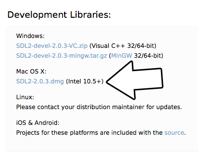
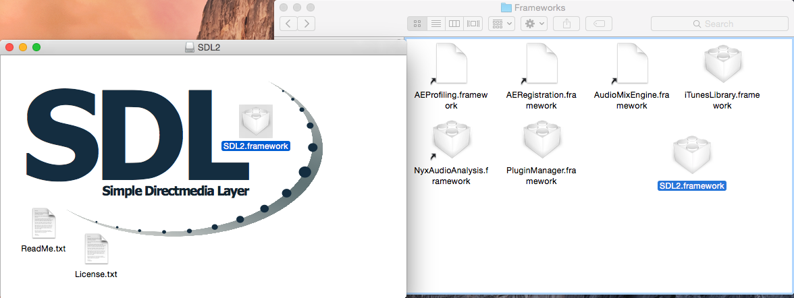
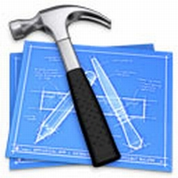

# Lazy Foo' Productions


# Setting up SDL 2 on Mac OS X Yosemite

[1)](#1)
First thing you need to do is download the OS X development libraries from the
[SDL website](http://www.libsdl.org/download-2.0.php#source).


[2)](#2)
Next open the dmg and copy the SDL2.framework to /Library/Frameworks. To go directly to a path in finder, press command+shift+g.


[3)](#3)
The framework may need to be resigned. To sign the framework, open up a terminal to:
```bash
 /Library/Frameworks/SDL2.framework/
```
and sign the framework using the command:
```cpp
 codesign -f -s - SDL2
```
[4)](#4)
Now that you've installed the development libraries, it's time to start up your IDE/compiler.
Select Your IDE/Compiler

|icon|IDE/Compiler|
|-----|:----------------:|
|[](SettingupSDL2onXCode6.1.md)|[XCode 6.1](SettingupSDL2onXCode6.1.md)|

[Back](index.md)
