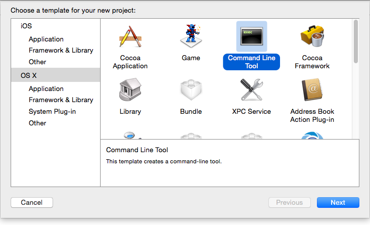
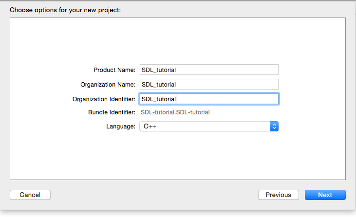
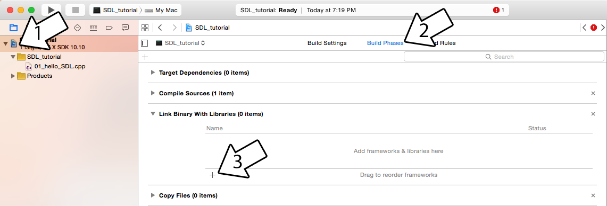
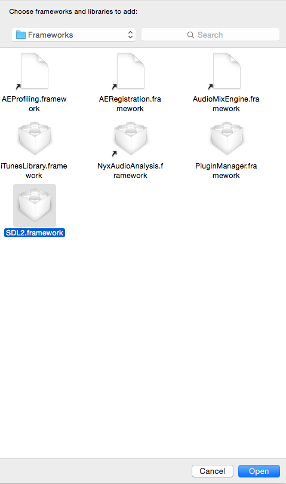
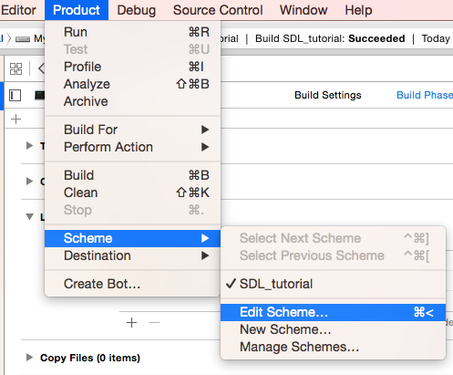
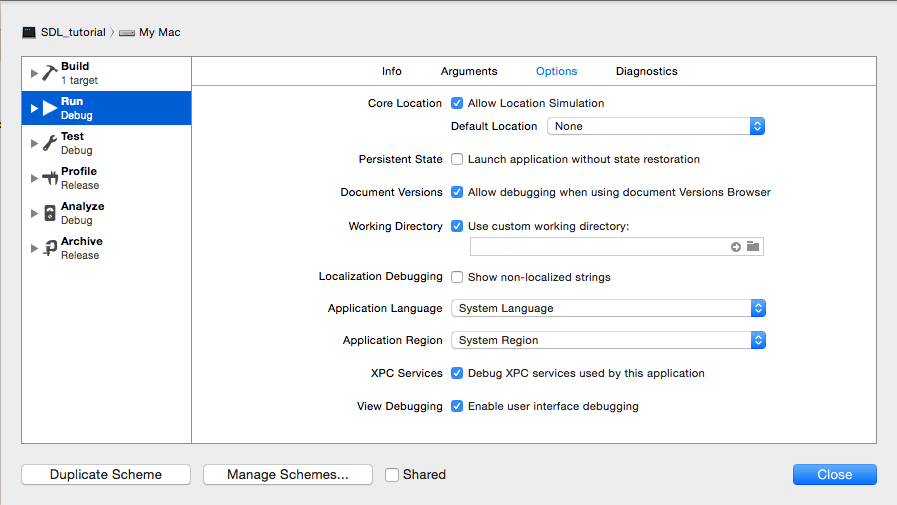

# Lazy Foo' Productions

# Setting up SDL 2 on XCode 6.1


With the SDL 2 framework installed, it's time to create an SDL project in XCode.

[5)](#5)
Create a new command line project:



You can set up this part of the project however you want, but do make sure to set it up as C++ project:



[6)](#6)
Select your SDL project and go to the Build Phases tab. In the Link Binary with Libraries section, click the plus:



To add the SDL 2 framework, click Add Other and go to /Library/Frameworks/ using command+shift+g to select the SDL 2 framework and hit open.



[7)](#7)
Now go download the [source for lesson 01](zip/01_hello_SDL.zip). Add the source
files inside to your project.

By default in the tutorials, the SDL headers are included like this:
```cpp
 #include <SDL/SDL.h>
```
SDL on Mac OS X does things differently, so we have to include the headers like this:
```cpp
 #include <SDL2/SDL.h>
```
Now build. If there are any errors, make sure you didn't skip a step.

[8)](#8)
In order for your application to be able to find the files you use for the application, you need to set the working directory. Go to product, scheme, and edit scheme:



Here you check Use Custom Working Directory and set the working directory. The working directory is where the application will think it is operating in.
I recommend setting it to your project directory and putting the tutorial folders we'll be using in that directory.



If your project can't load files for images, fonts, or sound it's because you did not set up your working directory properly.
[Hello SDL Part 2: Your First Graphics Window](hellosdlc.md)
