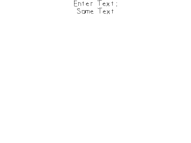

# Lazy Foo' Productions


# Text Input And Clipboard Handling



Getting text input from the keyboard is a common task in games. Here we'll be getting text using SDL 2's new text input and clip board handling.
```cpp
            //Main loop flag
bool quit = false;
//Event handler
SDL_Event e;
//Set text color as black
SDL_Color textColor = { 0, 0, 0, 0xFF };
//The current input text.
std::string inputText = "Some Text";
gInputTextTexture.loadFromRenderedText( inputText.c_str(), textColor );
//Enable text input
SDL_StartTextInput();
```
Before we go into the main loop we declare a string to hold our text and render it to a texture. We then call
[SDL_StartTextInput](http://wiki.libsdl.org/SDL_StartTextInput) so the SDL text input functionality is enabled.
```cpp
            //While application is running
while( !quit )
{
//The rerender text flag
bool renderText = false;
//Handle events on queue
while( SDL_PollEvent( &e ) != 0 )
{
```
We only want to update the input text texture when we need to so we have a flag that keeps track of whether we need to update the texture.
```cpp
                    //Special key input
else if( e.type == SDL_KEYDOWN )
{
//Handle backspace
if( e.key.keysym.sym == SDLK_BACKSPACE && inputText.length() > 0 )
{
//lop off character
inputText.pop_back();
renderText = true;
}
//Handle copy
else if( e.key.keysym.sym == SDLK_c && SDL_GetModState() & KMOD_CTRL )
{
SDL_SetClipboardText( inputText.c_str() );
}
//Handle paste
else if( e.key.keysym.sym == SDLK_v && SDL_GetModState() & KMOD_CTRL )
{
inputText = SDL_GetClipboardText();
renderText = true;
}
}
```
There are a couple special key presses we want to handle. When the user presses back space we want to remove the last character from the string.

When the user is holding control and presses c, we want to copy the current text to the clip board using
[SDL_SetClipboardText](http://wiki.libsdl.org/SDL_SetClipboardText). You can check if the ctrl key is being held using
[SDL_GetModState](http://wiki.libsdl.org/SDL_GetModState).

When the user does ctrl + v, we want to get the text from the clip board using [SDL_GetClipboardText](http://wiki.libsdl.org/SDL_GetClipboardText). Also
notice that whenever we alter the contents of the string we set the text update flag.
```cpp
                    //Special text input event
else if( e.type == SDL_TEXTINPUT )
{
//Not copy or pasting
if( !( ( e.text.text[ 0 ] == 'c' || e.text.text[ 0 ] == 'C' ) && ( e.text.text[ 0 ] == 'v' || e.text.text[ 0 ] == 'V' ) && SDL_GetModState() & KMOD_CTRL ) )
{
//Append character
inputText += e.text.text;
renderText = true;
}
}
}
```
With text input enabled, your key presses will also generate [SDL_TextInputEvent](http://wiki.libsdl.org/SDL_TextInputEvent)s which simplifies things like
shift key and caps lock. Here we first want to check that we're not getting a ctrl and c/v event because we want to ignore those since they are already handled as keydown events.
If it isn't a copy or paste event, we append the character to our input string.
```cpp
                //Rerender text if needed
if( renderText )
{
//Text is not empty
if( inputText != "" )
{
//Render new text
gInputTextTexture.loadFromRenderedText( inputText.c_str(), textColor );
}
//Text is empty
else
{
//Render space texture
gInputTextTexture.loadFromRenderedText( " ", textColor );
}
}
```
If the text render update flag has been set, we rerender the texture. One little hack we have here is if we have an empty string, we render a space because SDL_ttf will not render
an empty string.
```cpp
                //Clear screen
SDL_SetRenderDrawColor( gRenderer, 0xFF, 0xFF, 0xFF, 0xFF );
SDL_RenderClear( gRenderer );
//Render text textures
gPromptTextTexture.render( ( SCREEN_WIDTH - gPromptTextTexture.getWidth() ) / 2, 0 );
gInputTextTexture.render( ( SCREEN_WIDTH - gInputTextTexture.getWidth() ) / 2, gPromptTextTexture.getHeight() );
//Update screen
SDL_RenderPresent( gRenderer );
}
```
At the end of the main loop we render the prompt text and the input text.
```cpp
            //Disable text input
SDL_StopTextInput();
```
Once we're done with text input we disable it since enabling text input introduces some overhead.
</div><div class="tutFooter">
Download the media and source code for this tutorial [here](zip/32_text_input_and_clipboard_handling.zip).
