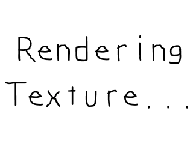

# Lazy Foo' Productions

# Texture Loading and Rendering



A major new addition to SDL 2 is the texture rendering API. This gives you fast, flexible hardware based rendering. In this tutorial we'll be using this new rendering
technique.
```cpp
//Loads individual image as texture
SDL_Texture* loadTexture( std::string path );
//The window we'll be rendering to
SDL_Window* gWindow = NULL;
//The window renderer
SDL_Renderer* gRenderer = NULL;
//Current displayed texture
SDL_Texture* gTexture = NULL;
```
Textures in SDL have their own data type intuitively called a [SDL_Texture](http://wiki.libsdl.org/SDL_Texture). When we deal with SDL textures you need
an SDL_Renderer to render it to the screen which is why we declare a global renderer named "gRenderer".

As you can also see we have a new image loading routine with loadTexture and a globally declared texture we're going to load.
```cpp
  //Create window
gWindow = SDL_CreateWindow( "SDL Tutorial", SDL_WINDOWPOS_UNDEFINED, SDL_WINDOWPOS_UNDEFINED, SCREEN_WIDTH, SCREEN_HEIGHT, SDL_WINDOW_SHOWN );
if( gWindow == NULL )
{
printf( "Window could not be created! SDL Error: %sn", SDL_GetError() );
success = false;
}
else
{
//Create renderer for window
gRenderer = SDL_CreateRenderer( gWindow, -1, SDL_RENDERER_ACCELERATED );
if( gRenderer == NULL )
{
printf( "Renderer could not be created! SDL Error: %sn", SDL_GetError() );
success = false;
}
else
{
//Initialize renderer color
SDL_SetRenderDrawColor( gRenderer, 0xFF, 0xFF, 0xFF, 0xFF );
//Initialize PNG loading
int imgFlags = IMG_INIT_PNG;
if( !( IMG_Init( imgFlags ) & imgFlags ) )
{
printf( "SDL_image could not initialize! SDL_image Error: %sn", IMG_GetError() );
success = false;
}
}
}
```
After we create our window, we have to create a renderer for our window so we can render textures on it. Fortunately this is easily done with a call to
[SDL_CreateRenderer](http://wiki.libsdl.org/SDL_CreateRenderer).

After creating the renderer, we want to initialize the rendering color using
[SDL_SetRenderDrawColor](http://wiki.libsdl.org/SDL_SetRenderDrawColor). This controls what color is used for various rendering operations.
```cpp
SDL_Texture* loadTexture( std::string path )
{
//The final texture
SDL_Texture* newTexture = NULL;
//Load image at specified path
SDL_Surface* loadedSurface = IMG_Load( path.c_str() );
if( loadedSurface == NULL )
{
printf( "Unable to load image %s! SDL_image Error: %sn", path.c_str(), IMG_GetError() );
}
else
{
//Create texture from surface pixels
newTexture = SDL_CreateTextureFromSurface( gRenderer, loadedSurface );
if( newTexture == NULL )
{
printf( "Unable to create texture from %s! SDL Error: %sn", path.c_str(), SDL_GetError() );
}
//Get rid of old loaded surface
SDL_FreeSurface( loadedSurface );
}
return newTexture;
}
```
Our texture loading function looks largely the same as before only now instead of converting the loaded surface to the display format, we create a texture from the loaded surface
using [SDL_CreateTextureFromSurface](http://wiki.libsdl.org/SDL_CreateTextureFromSurface). Like before, this function creates a new texture from an
existing surface which means like before we have to free the loaded surface and then return the loaded texture.
```cpp
bool loadMedia()
{
//Loading success flag
bool success = true;
//Load PNG texture
gTexture = loadTexture( "07_texture_loading_and_rendering/texture.png" );
if( gTexture == NULL )
{
printf( "Failed to load texture image!n" );
success = false;
}
return success;
}
void close()
{
//Free loaded image
SDL_DestroyTexture( gTexture );
gTexture = NULL;
//Destroy window
SDL_DestroyRenderer( gRenderer );
SDL_DestroyWindow( gWindow );
gWindow = NULL;
gRenderer = NULL;
//Quit SDL subsystems
IMG_Quit();
SDL_Quit();
}
```
Since texture loading is abstracted with our image loading function, the loadMedia() function works pretty much the same as before.

In our clean up function, we have to remember to deallocate our textures using [SDL_DestroyTexture](http://wiki.libsdl.org/SDL_DestroyTexture).
```cpp
//While application is running
while( !quit )
{
//Handle events on queue
while( SDL_PollEvent( &e ) != 0 )
{
//User requests quit
if( e.type == SDL_QUIT )
{
quit = true;
}
}
//Clear screen
SDL_RenderClear( gRenderer );
//Render texture to screen
SDL_RenderCopy( gRenderer, gTexture, NULL, NULL );
//Update screen
SDL_RenderPresent( gRenderer );
}
```
In the [main loop](index-3.php.htm) after the event loop, we call
[SDL_RenderClear](http://wiki.libsdl.org/SDL_RenderClear). This function fills the screen with the color that was last set with SDL_SetRenderDrawColor.

With the screen cleared, we render the texture with [SDL_RenderCopy](http://wiki.libsdl.org/SDL_RenderCopy). With the texture rendered, we still have to
update the screen, but since we're not using SDL_Surfaces to render we can't use SDL_UpdateWindowSurface. Instead we have to use
[SDL_RenderPresent](http://wiki.libsdl.org/SDL_RenderPresent).

Download the media and source code for this tutorial [here](zip/07_texture_loading_and_rendering.zip).
