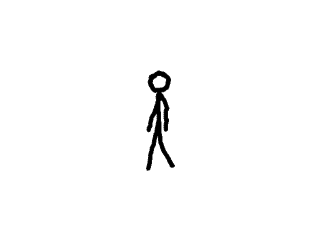

# Lazy Foo' Productions


# Texture Streaming




Sometime we want to render pixel data from a source other than a bitmap like a web cam. Using texture stream we can render pixels from any source.
```cpp
//Texture wrapper class
class LTexture
{
public:
//Initializes variables
LTexture();
//Deallocates memory
~LTexture();
//Loads image at specified path
bool loadFromFile( std::string path );
#ifdef _SDL_TTF_H
//Creates image from font string
bool loadFromRenderedText( std::string textureText, SDL_Color textColor );
#endif
//Creates blank texture
bool createBlank( int width, int height );
//Deallocates texture
void free();
//Set color modulation
void setColor( Uint8 red, Uint8 green, Uint8 blue );
//Set blending
void setBlendMode( SDL_BlendMode blending );
//Set alpha modulation
void setAlpha( Uint8 alpha );
//Renders texture at given point
void render( int x, int y, SDL_Rect* clip = NULL, double angle = 0.0, SDL_Point* center = NULL, SDL_RendererFlip flip = SDL_FLIP_NONE );
//Gets image dimensions
int getWidth();
int getHeight();
//Pixel manipulators
bool lockTexture();
bool unlockTexture();
void* getPixels();
void copyPixels( void* pixels );
int getPitch();
Uint32 getPixel32( unsigned int x, unsigned int y );
private:
//The actual hardware texture
SDL_Texture* mTexture;
void* mPixels;
int mPitch;
//Image dimensions
int mWidth;
int mHeight;
};
```
Here we're add more functionality to our texture class. The createBlank function allocates a blank texture that we can copy data to when streaming. The copyPixels function copies in
the pixel data we want to stream.
```cpp
//A test animation stream
class DataStream
{
public:
//Initializes internals
DataStream();
//Loads initial data
bool loadMedia();
//Deallocator
void free();
//Gets current frame data
void* getBuffer();
private:
//Internal data
SDL_Surface* mImages[ 4 ];
int mCurrentImage;
int mDelayFrames;
};
```
Here is our data stream class. We won't go deep into how it works because we don't really care. When dealing with web cam, video decoding, etc APIs they typically don't go deep into
how they work because all we care about is getting the video and audio data from them.

All we really care about is that getBuffer function which gets the current pixels from the data buffer.
```cpp
bool LTexture::createBlank( int width, int height )
{
//Create uninitialized texture
mTexture = SDL_CreateTexture( gRenderer, SDL_PIXELFORMAT_RGBA8888, SDL_TEXTUREACCESS_STREAMING, width, height );
if( mTexture == NULL )
{
printf( "Unable to create blank texture! SDL Error: %sn", SDL_GetError() );
}
else
{
mWidth = width;
mHeight = height;
}
return mTexture != NULL;
}
```
As you can see, all this function does is create a 32bit RGBA texture with stream access. One thing you have to make sure of when creating your texture is that the format of the
texture pixels matches the format of the pixels we're streaming.
```cpp
void LTexture::copyPixels( void* pixels )
{
//Texture is locked
if( mPixels != NULL )
{
//Copy to locked pixels
memcpy( mPixels, pixels, mPitch * mHeight );
}
}
```
Here is our function to copy in the pixels from the stream. The function assumes the texture is locked and that the pixels are from an image the same size as the texture.
```cpp
            //While application is running
while( !quit )
{
//Handle events on queue
while( SDL_PollEvent( &e ) != 0 )
{
//User requests quit
if( e.type == SDL_QUIT )
{
quit = true;
}
}
//Clear screen
SDL_SetRenderDrawColor( gRenderer, 0xFF, 0xFF, 0xFF, 0xFF );
SDL_RenderClear( gRenderer );
//Copy frame from buffer
gStreamingTexture.lockTexture();
gStreamingTexture.copyPixels( gDataStream.getBuffer() );
gStreamingTexture.unlockTexture();
//Render frame
gStreamingTexture.render( ( SCREEN_WIDTH - gStreamingTexture.getWidth() ) / 2, ( SCREEN_HEIGHT - gStreamingTexture.getHeight() ) / 2 );
//Update screen
SDL_RenderPresent( gRenderer );
}
```
In the main loop rendering we lock our stream texture, copy the pixels from the stream and then unlock the texture. With our texture holding the latest image from the stream, we
render the image to the screen.

When dealing with decoding APIs things may get trickier where we have to convert from one format to another but ultimately all we need is a means to get the pixel data and copy it
to the screen.

Download the media and source code for this tutorial [here](zip/42_texture_streaming.zip).
