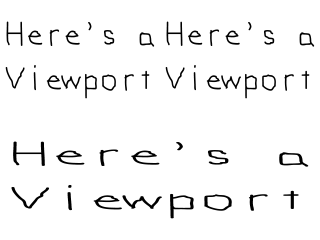

# Lazy Foo' Productions

# The Viewport



Some times you only want to render part of the screen for things like minimaps. Using the viewport you can control where you render on the screen.
```cpp
//Top left corner viewport
SDL_Rect topLeftViewport;
topLeftViewport.x = 0;
topLeftViewport.y = 0;
topLeftViewport.w = SCREEN_WIDTH / 2;
topLeftViewport.h = SCREEN_HEIGHT / 2;
SDL_RenderSetViewport( gRenderer, &topLeftViewport );
//Render texture to screen
SDL_RenderCopy( gRenderer, gTexture, NULL, NULL );
```
After we cleared the screen, it's time to get drawing. There's 3 regions we're going to draw a full screen image to:


First we're going to render the top left. This is as easy as creating a rectangle with half the width/height as the screen, and passing this region to
[SDL_RenderSetViewport](http://wiki.libsdl.org/SDL_RenderSetViewport). Any rendering done after that call will render inside the region defined by the
given viewport. It will also use the coordinate system of the window it was created in, so the bottom of the view we created will still be y = 480 even though it's only 240 pixels
down from the top.
```cpp
  //Top right viewport
SDL_Rect topRightViewport;
topRightViewport.x = SCREEN_WIDTH / 2;
topRightViewport.y = 0;
topRightViewport.w = SCREEN_WIDTH / 2;
topRightViewport.h = SCREEN_HEIGHT / 2;
SDL_RenderSetViewport( gRenderer, &topRightViewport );
//Render texture to screen
SDL_RenderCopy( gRenderer, gTexture, NULL, NULL );
```
Here we define the top right area and draw to it. It's pretty much the same as before, only now the x coordinate is half the screen over.
```cpp
//Bottom viewport
SDL_Rect bottomViewport;
bottomViewport.x = 0;
bottomViewport.y = SCREEN_HEIGHT / 2;
bottomViewport.w = SCREEN_WIDTH;
bottomViewport.h = SCREEN_HEIGHT / 2;
SDL_RenderSetViewport( gRenderer, &bottomViewport );
//Render texture to screen
SDL_RenderCopy( gRenderer, gTexture, NULL, NULL );
//Update screen
SDL_RenderPresent( gRenderer );
```
Finally we render one more time in the bottom half of the screen. Again, the view port will use the same coordinate system as the window it is used in, so the image will appear
squished since the viewport is half the height.

Download the media and source code for this tutorial [here](zip/09_the_viewport.zip).
