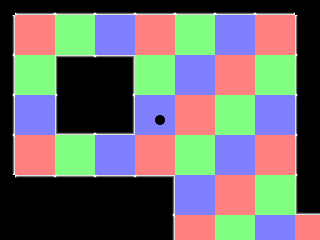
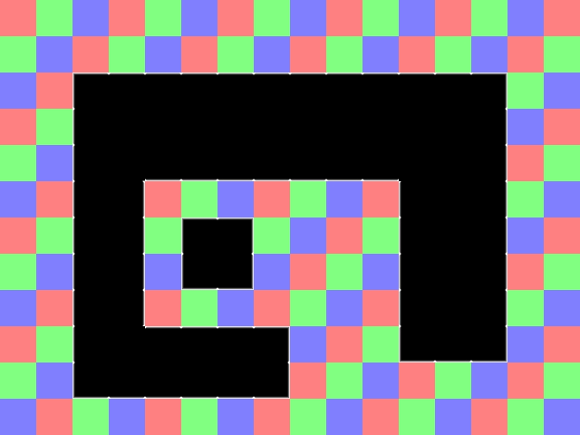
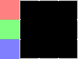
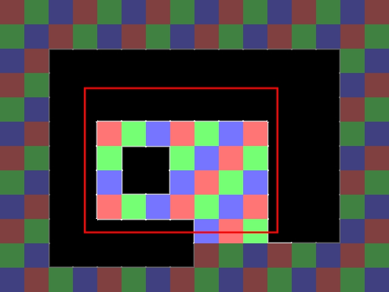

# Lazy Foo' Productions

# Tiling




Tiling is a way of making levels out of uniformly sized reusable pieces. In this tutorial we'll be making a 1280x960 sized level of out only a 160x120 sized tile set.

Say if we want to make a level like this:


We could make one huge level or we could create a tile set of 12 pieces:



And then create a level out of those pieces allowing us to save memory and save time by reusing pieces. This is why back in the early days of gaming tiling engines were so popular
on low resource systems and are still used today in some games.
```cpp
//Using SDL, SDL_image, standard IO, strings, and file streams
#include <SDL.h>
#include <SDL_image.h>
#include <stdio.h>
#include <string>
#include <fstream>
```
In our previous tutorials we did our [file reading and writing with SDL RWOps](File_Reading_and_Writing.md). Here we'll be using fstream which
is part of the standard C++ library and is relatively easy to use with text files.
```cpp
//Screen dimension constants
const int SCREEN_WIDTH = 640;
const int SCREEN_HEIGHT = 480;
//The dimensions of the level
const int LEVEL_WIDTH = 1280;
const int LEVEL_HEIGHT = 960;
//Tile constants
const int TILE_WIDTH = 80;
const int TILE_HEIGHT = 80;
const int TOTAL_TILES = 192;
const int TOTAL_TILE_SPRITES = 12;
//The different tile sprites
const int TILE_RED = 0;
const int TILE_GREEN = 1;
const int TILE_BLUE = 2;
const int TILE_CENTER = 3;
const int TILE_TOP = 4;
const int TILE_TOPRIGHT = 5;
const int TILE_RIGHT = 6;
const int TILE_BOTTOMRIGHT = 7;
const int TILE_BOTTOM = 8;
const int TILE_BOTTOMLEFT = 9;
const int TILE_LEFT = 10;
const int TILE_TOPLEFT = 11;
```
Here we're defining some constants. We'll be using [scrolling](Scrolling.md) so we have constants for both the screen and the level. We'll
also have constants to define the tiles and the tile types.
```cpp
//The tile
class Tile
{
public:
//Initializes position and type
Tile( int x, int y, int tileType );
//Shows the tile
void render( SDL_Rect& camera );
//Get the tile type
int getType();
//Get the collision box
SDL_Rect getBox();
private:
//The attributes of the tile
SDL_Rect mBox;
//The tile type
int mType;
};
```
Here is our tile class with a constructor that defines position and type, a renderer that uses a camera, and some accessors to get the tile's type and collision box. In terms of data
members we have a collision box and type indicator.

Normally it's a good idea to have [position and collider separate when doing collision detection](Collision_Detection.md), but for the sake of
simplicity we're using the collider to hold position.
```cpp
//The dot that will move around on the screen
class Dot
{
public:
//The dimensions of the dot
static const int DOT_WIDTH = 20;
static const int DOT_HEIGHT = 20;
//Maximum axis velocity of the dot
static const int DOT_VEL = 10;
//Initializes the variables
Dot();
//Takes key presses and adjusts the dot's velocity
void handleEvent( SDL_Event& e );
//Moves the dot and check collision against tiles
void move( Tile *tiles[] );
//Centers the camera over the dot
void setCamera( SDL_Rect& camera );
//Shows the dot on the screen
void render( SDL_Rect& camera );
private:
//Collision box of the dot
SDL_Rect mBox;
//The velocity of the dot
int mVelX, mVelY;
};
```
Here is the dot class yet again, now with the ability to check for collision against the tiles when moving.
```cpp
//Starts up SDL and creates window
bool init();
//Loads media
bool loadMedia( Tile* tiles[] );
//Frees media and shuts down SDL
void close( Tile* tiles[] );
//Box collision detector
bool checkCollision( SDL_Rect a, SDL_Rect b );
//Checks collision box against set of tiles
bool touchesWall( SDL_Rect box, Tile* tiles[] );
//Sets tiles from tile map
bool setTiles( Tile *tiles[] );
```
Our media loading function will also be initializing tiles so it need to take them in as an argument.

We also the touchesWall function that checks a collision box against every wall in a tile set which will be used when we need to check the dot against the whole tile set. Finally
the setTiles function loads and sets the tiles.
```cpp
Tile::Tile( int x, int y, int tileType )
{
//Get the offsets
mBox.x = x;
mBox.y = y;
//Set the collision box
mBox.w = TILE_WIDTH;
mBox.h = TILE_HEIGHT;
//Get the tile type
mType = tileType;
}
```
The tile constructor initializes position, dimensions, and type.
```cpp
void Tile::render( SDL_Rect& camera )
{
//If the tile is on screen
if( checkCollision( camera, mBox ) )
{
//Show the tile
gTileTexture.render( mBox.x - camera.x, mBox.y - camera.y, &gTileClips[ mType ] );
}
}
```
When we render we only want to show tiles that are in the camera's sight:



So we check if the tile collides with the camera before rendering it. Notice also that we render the tile relative to the camera.
```cpp
int Tile::getType()
{
return mType;
}
SDL_Rect Tile::getBox()
{
return mBox;
}
```
And here are the accessors to get the tile's type and collision box.
```cpp
void Dot::move( Tile *tiles[] )
{
//Move the dot left or right
mBox.x += mVelX;
//If the dot went too far to the left or right or touched a wall
if( ( mBox.x < 0 ) || ( mBox.x + DOT_WIDTH > LEVEL_WIDTH ) || touchesWall( mBox, tiles ) )
{
//move back
mBox.x -= mVelX;
}
//Move the dot up or down
mBox.y += mVelY;
//If the dot went too far up or down or touched a wall
if( ( mBox.y < 0 ) || ( mBox.y + DOT_HEIGHT > LEVEL_HEIGHT ) || touchesWall( mBox, tiles ) )
{
//move back
mBox.y -= mVelY;
}
}
```
When we move the dot we check if it goes off the level or hits a wall tile. If it does we correct it.
```cpp
void Dot::setCamera( SDL_Rect& camera )
{
//Center the camera over the dot
camera.x = ( mBox.x + DOT_WIDTH / 2 ) - SCREEN_WIDTH / 2;
camera.y = ( mBox.y + DOT_HEIGHT / 2 ) - SCREEN_HEIGHT / 2;
//Keep the camera in bounds
if( camera.x < 0 )
{
camera.x = 0;
}
if( camera.y < 0 )
{
camera.y = 0;
}
if( camera.x > LEVEL_WIDTH - camera.w )
{
camera.x = LEVEL_WIDTH - camera.w;
}
if( camera.y > LEVEL_HEIGHT - camera.h )
{
camera.y = LEVEL_HEIGHT - camera.h;
}
}
void Dot::render( SDL_Rect& camera )
{
//Show the dot
gDotTexture.render( mBox.x - camera.x, mBox.y - camera.y );
}
```
Here is the rendering code largely lifted from the scrolling/camera tutorial.
```cpp
bool loadMedia( Tile* tiles[] )
{
//Loading success flag
bool success = true;
//Load dot texture
if( !gDotTexture.loadFromFile( "39_tiling/dot.bmp" ) )
{
printf( "Failed to load dot texture!n" );
success = false;
}
//Load tile texture
if( !gTileTexture.loadFromFile( "39_tiling/tiles.png" ) )
{
printf( "Failed to load tile set texture!n" );
success = false;
}
//Load tile map
if( !setTiles( tiles ) )
{
printf( "Failed to load tile set!n" );
success = false;
}
return success;
}
```
In our loading function we not only load the textures but also the tile set.
```cpp
bool setTiles( Tile* tiles[] )
{
//Success flag
bool tilesLoaded = true;
//The tile offsets
int x = 0, y = 0;
//Open the map
std::ifstream map( "39_tiling/lazy.map" );
//If the map couldn't be loaded
if( map == NULL )
{
printf( "Unable to load map file!n" );
tilesLoaded = false;
}
```
Near the top of the setTiles function we declare x/y offsets that define where we'll be place the tiles. As we load in more tiles we'll be shift the x/y position left to right and
top to bottom.

We then open the lazy.map file which is just a text file with the follow contents:

```
00 01 02 00 01 02 00 01 02 00 01 02 00 01 02 00

01 02 00 01 02 00 01 02 00 01 02 00 01 02 00 01

02 00 11 04 04 04 04 04 04 04 04 04 04 05 01 02

00 01 10 03 03 03 03 03 03 03 03 03 03 06 02 00

01 02 10 03 08 08 08 08 08 08 08 03 03 06 00 01

02 00 10 06 00 01 02 00 01 02 00 10 03 06 01 02

00 01 10 06 01 11 05 01 02 00 01 10 03 06 02 00

01 02 10 06 02 09 07 02 00 01 02 10 03 06 00 01

02 00 10 06 00 01 02 00 01 02 00 10 03 06 01 02

00 01 10 03 04 04 04 05 02 00 01 09 08 07 02 00

01 02 09 08 08 08 08 07 00 01 02 00 01 02 00 01

02 00 01 02 00 01 02 00 01 02 00 01 02 00 01 02
```

Using fstream we can read text from a file much like we would read keyboard input with iostream. Before we can continue we have to check if the map loaded correctly by checking if
it's NULL. If it is NULL we abort and if not we continue loading the file.

Note: depending on which compiler you use (like certain versions of **Visual Studio**), this piece of code may not compile. Instead of checking if **map == NULL**, you have to check **!map.is_open()**.
```cpp
    else
{
//Initialize the tiles
for( int i = 0; i < TOTAL_TILES; ++i )
{
//Determines what kind of tile will be made
int tileType = -1;
//Read tile from map file
map >> tileType;
//If the was a problem in reading the map
if( map.fail() )
{
//Stop loading map
printf( "Error loading map: Unexpected end of file!n" );
tilesLoaded = false;
break;
}
//If the number is a valid tile number
if( ( tileType >= 0 ) && ( tileType < TOTAL_TILE_SPRITES ) )
{
tiles[ i ] = new Tile( x, y, tileType );
}
//If we don't recognize the tile type
else
{
//Stop loading map
printf( "Error loading map: Invalid tile type at %d!n", i );
tilesLoaded = false;
break;
}
```
If the file loaded successfully we have a for loop that reads in all the numbers from the text file. We read a number into the tileType variable and then check if the read failed.
If the read failed, we abort.

If not we then check if the tile type number is valid. If it is valid we create a new tile of the given type, if not we print an error and stop loading tiles.
```cpp
            //Move to next tile spot
x += TILE_WIDTH;
//If we've gone too far
if( x >= LEVEL_WIDTH )
{
//Move back
x = 0;
//Move to the next row
y += TILE_HEIGHT;
}
}
```
After loading a tile we move to the text tile position to the right. If we reached the end of a line of tiles, we move down to the next row.
```cpp
        //Clip the sprite sheet
if( tilesLoaded )
{
gTileClips[ TILE_RED ].x = 0;
gTileClips[ TILE_RED ].y = 0;
gTileClips[ TILE_RED ].w = TILE_WIDTH;
gTileClips[ TILE_RED ].h = TILE_HEIGHT;
gTileClips[ TILE_GREEN ].x = 0;
gTileClips[ TILE_GREEN ].y = 80;
gTileClips[ TILE_GREEN ].w = TILE_WIDTH;
gTileClips[ TILE_GREEN ].h = TILE_HEIGHT;
gTileClips[ TILE_BLUE ].x = 0;
gTileClips[ TILE_BLUE ].y = 160;
gTileClips[ TILE_BLUE ].w = TILE_WIDTH;
gTileClips[ TILE_BLUE ].h = TILE_HEIGHT;
gTileClips[ TILE_TOPLEFT ].x = 80;
gTileClips[ TILE_TOPLEFT ].y = 0;
gTileClips[ TILE_TOPLEFT ].w = TILE_WIDTH;
gTileClips[ TILE_TOPLEFT ].h = TILE_HEIGHT;
gTileClips[ TILE_LEFT ].x = 80;
gTileClips[ TILE_LEFT ].y = 80;
gTileClips[ TILE_LEFT ].w = TILE_WIDTH;
gTileClips[ TILE_LEFT ].h = TILE_HEIGHT;
gTileClips[ TILE_BOTTOMLEFT ].x = 80;
gTileClips[ TILE_BOTTOMLEFT ].y = 160;
gTileClips[ TILE_BOTTOMLEFT ].w = TILE_WIDTH;
gTileClips[ TILE_BOTTOMLEFT ].h = TILE_HEIGHT;
gTileClips[ TILE_TOP ].x = 160;
gTileClips[ TILE_TOP ].y = 0;
gTileClips[ TILE_TOP ].w = TILE_WIDTH;
gTileClips[ TILE_TOP ].h = TILE_HEIGHT;
gTileClips[ TILE_CENTER ].x = 160;
gTileClips[ TILE_CENTER ].y = 80;
gTileClips[ TILE_CENTER ].w = TILE_WIDTH;
gTileClips[ TILE_CENTER ].h = TILE_HEIGHT;
gTileClips[ TILE_BOTTOM ].x = 160;
gTileClips[ TILE_BOTTOM ].y = 160;
gTileClips[ TILE_BOTTOM ].w = TILE_WIDTH;
gTileClips[ TILE_BOTTOM ].h = TILE_HEIGHT;
gTileClips[ TILE_TOPRIGHT ].x = 240;
gTileClips[ TILE_TOPRIGHT ].y = 0;
gTileClips[ TILE_TOPRIGHT ].w = TILE_WIDTH;
gTileClips[ TILE_TOPRIGHT ].h = TILE_HEIGHT;
gTileClips[ TILE_RIGHT ].x = 240;
gTileClips[ TILE_RIGHT ].y = 80;
gTileClips[ TILE_RIGHT ].w = TILE_WIDTH;
gTileClips[ TILE_RIGHT ].h = TILE_HEIGHT;
gTileClips[ TILE_BOTTOMRIGHT ].x = 240;
gTileClips[ TILE_BOTTOMRIGHT ].y = 160;
gTileClips[ TILE_BOTTOMRIGHT ].w = TILE_WIDTH;
gTileClips[ TILE_BOTTOMRIGHT ].h = TILE_HEIGHT;
}
}
//Close the file
map.close();
//If the map was loaded fine
return tilesLoaded;
}
```
After all the tiles are loaded we set the clip rectangles for the tile sprites. Finally we load the map file and return.
```cpp
bool touchesWall( SDL_Rect box, Tile* tiles[] )
{
//Go through the tiles
for( int i = 0; i < TOTAL_TILES; ++i )
{
//If the tile is a wall type tile
if( ( tiles[ i ]->getType() >= TILE_CENTER ) && ( tiles[ i ]->getType() <= TILE_TOPLEFT ) )
{
//If the collision box touches the wall tile
if( checkCollision( box, tiles[ i ]->getBox() ) )
{
return true;
}
}
}
//If no wall tiles were touched
return false;
}
```
The touchesWall function checks a given collision box against tiles of type TILE_CENTER, TILE_TOP, TILE_TOPRIGHT, TILE_RIGHT, TILE_BOTTOMRIGHT, TILE_BOTTOM, TILE_BOTTOMLEFT, TILE_LEFT,
and TILE_TOPLEFT which are all wall tiles. If you check back when we defined these constants, you'll see that these are numbered right next to each other so all we have to do is
check if the type is between TILE_CENTER and TILE_TOPLEFT.

If the given collision box collides with any tile that is a wall this function returns true,
```cpp
        //The level tiles
Tile* tileSet[ TOTAL_TILES ];
//Load media
if( !loadMedia( tileSet ) )
{
printf( "Failed to load media!n" );
}
```
In the main function right before we load the media we declare our array of tile pointers.
```cpp
            //While application is running
while( !quit )
{
//Handle events on queue
while( SDL_PollEvent( &e ) != 0 )
{
//User requests quit
if( e.type == SDL_QUIT )
{
quit = true;
}
//Handle input for the dot
dot.handleEvent( e );
}
//Move the dot
dot.move( tileSet );
dot.setCamera( camera );
//Clear screen
SDL_SetRenderDrawColor( gRenderer, 0xFF, 0xFF, 0xFF, 0xFF );
SDL_RenderClear( gRenderer );
//Render level
for( int i = 0; i < TOTAL_TILES; ++i )
{
tileSet[ i ]->render( camera );
}
//Render dot
dot.render( camera );
//Update screen
SDL_RenderPresent( gRenderer );
}
```
Our main loop is pretty much the same with some adjustments. When we move the dot we pass in the tile set and then set the camera over the dot after it moved. We then render the
tile set and finally render the dot over the level.

Download the media and source code for this tutorial [here](zip/39_tiling.zip).
