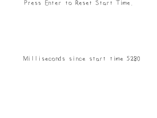

# Lazy Foo' Productions


# Timing



Another important part of any sort of gaming API is the ability to handle time. In this tutorial we'll make a timer we can restart.
```cpp
//Using SDL, SDL_image, SDL_ttf, standard IO, strings, and string streams
#include <SDL.h>
#include <SDL_image.h>
#include <SDL_ttf.h>
#include <stdio.h>
#include <string>
#include <sstream>
```
For this tutorial we'll be using string streams and have to include the sstream header which should come standard with your C++ compiler.
```cpp
bool loadMedia()
{
//Loading success flag
bool success = true;
//Open the font
gFont = TTF_OpenFont( "22_timing/lazy.ttf", 28 );
if( gFont == NULL )
{
printf( "Failed to load lazy font! SDL_ttf Error: %sn", TTF_GetError() );
success = false;
}
else
{
//Set text color as black
SDL_Color textColor = { 0, 0, 0, 255 };
//Load prompt texture
if( !gPromptTextTexture.loadFromRenderedText( "Press Enter to Reset Start Time.", textColor ) )
{
printf( "Unable to render prompt texture!n" );
success = false;
}
}
return success;
}
```
As mentioned in the [font rendering tutorial](index-16.php.htm), you want to minimize the amount of times you render text. We'll have a
texture to prompt input and a texture to display the current time in milliseconds. The time texture changes every frame so we have to render that every frame, but the prompt texture
doesn't change so we can render it once in the file loading function.
```cpp
           //Main loop flag
bool quit = false;
//Event handler
SDL_Event e;
//Set text color as black
SDL_Color textColor = { 0, 0, 0, 255 };
//Current time start time
Uint32 startTime = 0;
//In memory text stream
std::stringstream timeText;
```
Before we enter the main loop we want to declare some variables. The two we want to pay attention to is the startTime variable (which is an **U**nsigned **int**eger that's
**32**bits) and the timeText variable which is a string stream.

For those of you who have never used string streams, just know that they function like iostreams only instead of reading or writing to the console, they allow you to read and write
to a string in memory. It'll be easier to see when we see them used further on in the program.
```cpp
    //While application is running
while( !quit )
{
//Handle events on queue
while( SDL_PollEvent( &e ) != 0 )
{
//User requests quit
if( e.type == SDL_QUIT )
{
quit = true;
}
//Reset start time on return keypress
else if( e.type == SDL_KEYDOWN && e.key.keysym.sym == SDLK_RETURN )
{
startTime = SDL_GetTicks();
}
}
```
There's a function called [SDL_GetTicks](http://wiki.libsdl.org/SDL_GetTicks) which returns the time since the program started in milliseconds.
For this demo, we'll be having a timer that restarts every time we press the return key.

Remember how we initialized the start time to 0 at the start of the program? This means the timer's time is just the current time since the program started returned by SDL_GetTicks.
If we were to restart the timer when SDL_GetTicks was at 5000 milliseconds (5 seconds), then at 10,000 milliseconds the current time - the start time would be 10000 minus 5000 would
be 5000 milliseconds. So even though the timer contained by SDL_GetTicks hasn't restarted, we can have a timer keep track of a relative start time and reset its start time.
```cpp
        //Set text to be rendered
timeText.str( "" );
timeText << "Milliseconds since start time " << SDL_GetTicks() - startTime;
```
Here we're using our string stream. First we call str with an empty string to initialize it to be empty. Then we treat it like cout and print to it "Milliseconds since start time "
and the current time minus the relative start time so it will print the time since we last started the timer.
```cpp     
           //Render text
if( !gTimeTextTexture.loadFromRenderedText( timeText.str().c_str(), textColor ) )
{
printf( "Unable to render time texture!n" );
}
```
Now that we have the time in a string stream, we can get a string from it and use it to render the current time to a texture.
```cpp
           //Clear screen
SDL_SetRenderDrawColor( gRenderer, 0xFF, 0xFF, 0xFF, 0xFF );
SDL_RenderClear( gRenderer );
//Render textures
gPromptTextTexture.render( ( SCREEN_WIDTH - gPromptTextTexture.getWidth() ) / 2, 0 );
gTimeTextTexture.render( ( SCREEN_WIDTH - gPromptTextTexture.getWidth() ) / 2, ( SCREEN_HEIGHT - gPromptTextTexture.getHeight() ) / 2 );
//Update screen
SDL_RenderPresent( gRenderer );
```
Finally we render the prompt texture and the time texture to the screen.
</div><div class="tutFooter">
Download the media and source code for this tutorial [here](zip/22_timing.zip).
