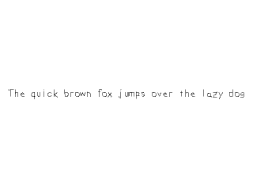

# Lazy Foo' Productions


# True Type Fonts



One way to render text with SDL is with the extension library SDL_ttf. SDL_ttf allows you to create images from TrueType fonts which we'll use here to create textures
from font text.
```cpp
//Using SDL, SDL_image, SDL_ttf, standard IO, math, and strings
#include <SDL.h>
#include <SDL_image.h>
#include <SDL_ttf.h>
#include <stdio.h>
#include <string>
#include <cmath>
```
To use SDL_ttf, you have to set up [the SDL_ttf extension library](http://www.libsdl.org/projects/SDL_ttf/) just like you would
[set up SDL_image](index-6.php.htm). Like before, it's just a matter of having the headers files,
library files, and binary files in the right place with your compiler configured to use them.
```cpp
//Texture wrapper class
class LTexture
{
public:
//Initializes variables
LTexture();
//Deallocates memory
~LTexture();
//Loads image at specified path
bool loadFromFile( std::string path );
//Creates image from font string
bool loadFromRenderedText( std::string textureText, SDL_Color textColor );
//Deallocates texture
void free();
//Set color modulation
void setColor( Uint8 red, Uint8 green, Uint8 blue );
//Set blending
void setBlendMode( SDL_BlendMode blending );
//Set alpha modulation
void setAlpha( Uint8 alpha );
//Renders texture at given point
void render( int x, int y, SDL_Rect* clip = NULL, double angle = 0.0, SDL_Point* center = NULL, SDL_RendererFlip flip = SDL_FLIP_NONE );
//Gets image dimensions
int getWidth();
int getHeight();
private:
//The actual hardware texture
SDL_Texture* mTexture;
//Image dimensions
int mWidth;
int mHeight;
};
```
Here we're adding another function to the [texture class](index-10.php.htm) called loadFromRenderedText. The way SDL_ttf works is that you
create a new image from a font and color. For our texture class all that means is that we're going to be loading our image from text rendered by SDL_ttf instead of a file.
```cpp
//The window we'll be rendering to
SDL_Window* gWindow = NULL;
//The window renderer
SDL_Renderer* gRenderer = NULL;
//Globally used font
TTF_Font *gFont = NULL;
//Rendered texture
LTexture gTextTexture;
```
For this and future tutorials, we'll be using a global font for our text rendering. In SDL_ttf, the data type for fonts is
[TTF_Font](http://www.libsdl.org/projects/docs/SDL_ttf/SDL_ttf_49.html).

We also have a texture which will be generated from the font.
```cpp
bool LTexture::loadFromRenderedText( std::string textureText, SDL_Color textColor )
{
//Get rid of preexisting texture
free();
//Render text surface
SDL_Surface* textSurface = TTF_RenderText_Solid( gFont, textureText.c_str(), textColor );
if( textSurface == NULL )
{
printf( "Unable to render text surface! SDL_ttf Error: %sn", TTF_GetError() );
}
else
{
//Create texture from surface pixels
mTexture = SDL_CreateTextureFromSurface( gRenderer, textSurface );
if( mTexture == NULL )
{
printf( "Unable to create texture from rendered text! SDL Error: %sn", SDL_GetError() );
}
else
{
//Get image dimensions
mWidth = textSurface->w;
mHeight = textSurface->h;
}
//Get rid of old surface
SDL_FreeSurface( textSurface );
}
//Return success
return mTexture != NULL;
}
```
Here is where we actually create the text texture we're going to render from the font. This function takes in the string of text we want to render and the color we want to use to
render it. After that, this function pretty much works like loading from a file does, only this time we're using a SDL_Surface created by SDL_ttf instead of a file.

After freeing any preexisting textures, we load a surface using [TTF_RenderText_Solid](http://www.libsdl.org/projects/SDL_ttf/docs/SDL_ttf_43.html). This
creates a solid color surface from the font, text, and color given. If the surface was created successfully,
[we create a texture out of it](index-7.php.htm) just like we did before when loading a surface from a file. After the text
texture is created, we can render with it just like any other texture.

There are other ways to render text that are smoother or blended. Experiment with the different types of rendering outlined in the
[SDL_ttf documentation](http://www.libsdl.org/projects/docs/SDL_ttf/SDL_ttf_35.html).
```cpp
       //Initialize PNG loading
int imgFlags = IMG_INIT_PNG;
if( !( IMG_Init( imgFlags ) & imgFlags ) )
{
printf( "SDL_image could not initialize! SDL_image Error: %sn", IMG_GetError() );
success = false;
}
//Initialize SDL_ttf
if( TTF_Init() == -1 )
{
printf( "SDL_ttf could not initialize! SDL_ttf Error: %sn", TTF_GetError() );
success = false;
}
```
Just like SDL_image, we have to initialize it or the font loading and rendering functions won't work properly. We start up SDL_ttf using
[TTF_init](http://www.libsdl.org/projects/SDL_ttf/docs/SDL_ttf_8.html). We can check for errors using TTF_GetError().
```cpp
bool loadMedia()
{
//Loading success flag
bool success = true;
//Open the font
gFont = TTF_OpenFont( "16_true_type_fonts/lazy.ttf", 28 );
if( gFont == NULL )
{
printf( "Failed to load lazy font! SDL_ttf Error: %sn", TTF_GetError() );
success = false;
}
else
{
//Render text
SDL_Color textColor = { 0, 0, 0 };
if( !gTextTexture.loadFromRenderedText( "The quick brown fox jumps over the lazy dog", textColor ) )
{
printf( "Failed to render text texture!n" );
success = false;
}
}
return success;
}
```
In our loading function, we load our font using [TTF_OpenFont](http://www.libsdl.org/projects/SDL_ttf/docs/SDL_ttf_14.html). This takes in the path to the
font file and the point size we want to render at.

If the font loaded successfully, we want to load a text texture using our loading method. As a general rule, you want to minimize the number of time you render text. Only rerender it
when you need to and since we're using the same text surface for this whole program, we only want to render once.
```cpp
void close()
{
//Free loaded images
gTextTexture.free();
//Free global font
TTF_CloseFont( gFont );
gFont = NULL;
//Destroy window
SDL_DestroyRenderer( gRenderer );
SDL_DestroyWindow( gWindow );
gWindow = NULL;
gRenderer = NULL;
//Quit SDL subsystems
TTF_Quit();
IMG_Quit();
SDL_Quit();
}

In our clean up function, we want to free the font using [TTF_CloseFont](http://www.libsdl.org/projects/SDL_ttf/docs/SDL_ttf_18.html). We also want to quit
the SDL_ttf library with [TTF_Quit](http://www.libsdl.org/projects/SDL_ttf/docs/SDL_ttf_10.html) to complete the clean up.
```cpp
     //While application is running
while( !quit )
{
//Handle events on queue
while( SDL_PollEvent( &e ) != 0 )
{
//User requests quit
if( e.type == SDL_QUIT )
{
quit = true;
}
}
//Clear screen
SDL_SetRenderDrawColor( gRenderer, 0xFF, 0xFF, 0xFF, 0xFF );
SDL_RenderClear( gRenderer );
//Render current frame
gTextTexture.render( ( SCREEN_WIDTH - gTextTexture.getWidth() ) / 2, ( SCREEN_HEIGHT - gTextTexture.getHeight() ) / 2 );
//Update screen
SDL_RenderPresent( gRenderer );
}
```
As you can see, after we render the text texture we can render it just like any other texture.

Download the media and source code for this tutorial [here](zip/16_true_type_fonts.zip).
