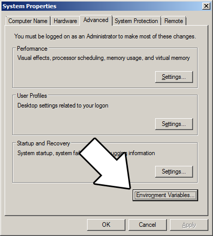
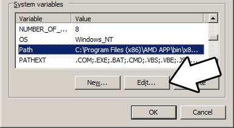

# Lazy Foo' Productions
# Setting up SDL 2 on MinGW


1) First thing you need to do is download SDL headers, libary and binaries. You will find them on the SDL website, specifically on [this page](http://libsdl.org/download-2.0.php).
You'll want to download the MinGW development libraries.

[](images/mingw_package-1.png)

Open the gzip archive and there should be a tar archive. Open up the tar archive and the should be a folder called SDL2-2._something_._something_. Inside of
that folder there should be a bunch of folders and files, most importantly **i686-w64-mingw32** which contains the 32bit library and **x86_64-w64-mingw32** which
contains the 64bit library.

**This is important:** most compilers still compile 32bit binaries by default to maximize compatibility. We will be using the 32bit binaries for this tutorial set.
It doesn't matter if you have a 64bit operating system, since we are compiling 32bit binaries we will be using the 32bit library.

Inside of i686-w64-mingw32 are the include, lib, and bin folders which contain everything we need compile and run SDL applications. Copy the contents of i686-w64-mingw32
to any directory you want. I recommend putting it in a folder that you dedicate to holding all your development libraries for MinGW. For these tutorials I'm putting it
in a directory I created C:mingw_dev_lib

2) Next you're going to want to get up the path for mingw so you can run mingw commands in any directory. Open up the system
menu either by A) right clicking My Computer and selecting Properties or B) going to the Control Panel and selecting the system menu. Once your in the system menu,
click advanced system settings.


and then click environment variables



Under system variables, select the "Path" variable and click edit.



What the path variable does is tell the OS where to look when running an executable. What we want to do is whenever we run the g++ command, the OS should look in the
MinGW bin directory where g++.exe is located. If you installed MinGW by itself, the MinGW bin directory should be

**C:MinGWbin**

Append it to the long list of paths with a semi-colon after it and click ok.


If you're using an IDE like Code::Blocks which uses MinGW, you can also set its MinGW bin directory which should be at

**C:Program Files (x86)CodeBlocksMinGWbin**

Now when ever you run a command that uses a MinGW executable, the OS will know to look in the MinGW bin directory.

If you run your program and it complains that it can't find SDL2.dll, it means you did not set the path correctly.

3) Now go download the [source for lesson 01](01_hello_SDL.zip). Extract the source
somewhere. Open up a command window in the directory by holding shift and right clicking.


Now compile by entering this big old command (This command assumed you have SDL 2 extracted at C:mingw_dev_lib):

```
 g++ 01_hello_SDL.cpp -IC:mingw_dev_libincludeSDL2 -LC:mingw_dev_liblib -w -Wl,-subsystem,windows -lmingw32 -lSDL2main -lSDL2 -o 01_hello_SDL
```
Having to manually punch in this compilation command gets very tedious very quickly. This is why I recommend using Make.

4) MingGW Make allows you to make build scripts that'll automate the compilation process.
From Basic `Makefile` `#OBJS` specifies which files to compile as part of the project
```
OBJS = 01_hello_SDL.cpp
#OBJ_NAME specifies the name of our exectuable
OBJ_NAME = 01_hello_SDL
#This is the target that compiles our executable
all : $(OBJS)
g++ $(OBJS) -IC:mingw_dev_libincludeSDL2 -LC:mingw_dev_liblib -w -Wl,-subsystem,windows -lmingw32 -lSDL2main -lSDL2 -o $(OBJ_NAME)
```
Here we have a basic Makefile. At the top we declare and set the "OBJS" macro which specifies which files we're compiling. Then we set the "OBJ_NAME" macro that specifies
the name of our executable.

After setting these two macros, we have the "all" target which compiles the program. It's followed by the dependencies which as you can see is the OBJS macro, because
obviously you need the source files to compile the program.

After specifying the name of the target and its dependencies, the command to create the target is on the next line. **The command to create the target must begin with a
tab or Make will reject it**.

As you would expect, the command to compile the program is largely the same as the command we would compile it off the command line. A key difference is that we have
macros that we insert into the command which makes things like adding new files to the project must easier since you only have to change the macro as opposed to changing
the whole command.

In future tutorials, we will be using more libraries. We should probably use more macros to make the process of adding them easier.
From `Makefile #OBJS` specifies which files to compile as part of the project
```
OBJS = 01_hello_SDL.cpp
#CC specifies which compiler we're using
CC = g++
#INCLUDE_PATHS specifies the additional include paths we'll need
INCLUDE_PATHS = -IC:mingw_dev_libincludeSDL2
#LIBRARY_PATHS specifies the additional library paths we'll need
LIBRARY_PATHS = -LC:mingw_dev_liblib
#COMPILER_FLAGS specifies the additional compilation options we're using
# -w suppresses all warnings
# -Wl,-subsystem,windows gets rid of the console window
COMPILER_FLAGS = -w -Wl,-subsystem,windows
#LINKER_FLAGS specifies the libraries we're linking against
LINKER_FLAGS = -lmingw32 -lSDL2main -lSDL2
#OBJ_NAME specifies the name of our exectuable
OBJ_NAME = 01_hello_SDL
#This is the target that compiles our executable
all : $(OBJS)
$(CC) $(OBJS) $(INCLUDE_PATHS) $(LIBRARY_PATHS) $(COMPILER_FLAGS) $(LINKER_FLAGS) -o $(OBJ_NAME)
```
Now our compilation command is much more flexible.

Near the top we have the macros that define the files we're compiling and the compiler we're using.

Next we have the "INCLUDE_PATHS" macro which specifies the additional directories we're getting header files from. As you can see, we're using the include directory
from the SDL2 folder we extacted earlier. The "LIBRARY_PATHS" sets the additional library file paths. Notice how there's a **-I** before every include directory
and a **-L** before every library directory.

The "COMPILER_FLAGS" macro are the additional options we use when compiling. In this case we're disabling all warnings and disabling the console window. The
"LINKER_FLAGS" macro specifies which libraries we're linking against. Here we're compiling against 32bit mingw, SDL2, and SDL2main. Notice how there's a **-l**
flag before every library.

Finally at the bottom we have our target compiling using all of our macros. Thanks to macros we can very easily change the macros to add more files and libraries as we
need them.

Save this Makefile code to a file named "Makefile" (case sensitive with no file extension) or you can use the one I premade [here](http://lazyfoo.net/tutorials/SDL/01_hello_SDL/windows/mingw/Makefile).
Open a command line in the directory with the source files and run the command **mingw32-make.exe**. Make will search for a file named "Makefile" in the directory
Make was called in and run the Makefile that will compile your code.

Now that you have SDL 2 compiling, it time to go onto part 2 of the tutorial.
[Hello SDL Part 2: Your First Graphics Window](index2.php.htm)
