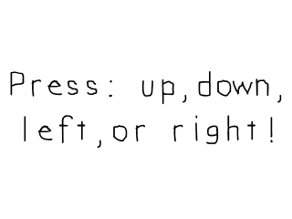

# Lazy Foo' Productions

# Key Presses



Xing out the window is just one of the events SDL is capable of handling. Another type of input used heavily in games is the keyboard. In this tutorial we're going to
make different images appear depending on which key you press.
```cpp
//Key press surfaces constants
enum KeyPressSurfaces
{
KEY_PRESS_SURFACE_DEFAULT,
KEY_PRESS_SURFACE_UP,
KEY_PRESS_SURFACE_DOWN,
KEY_PRESS_SURFACE_LEFT,
KEY_PRESS_SURFACE_RIGHT,
KEY_PRESS_SURFACE_TOTAL
};
```
Near the top of the source code we declare an enumeration of the different surfaces we have. Enumerations are a shorthand way to do symbolic constants instead of having to do
const int KEY_PRESS_SURFACE_DEFAULT = 0; const int KEY_PRESS_SURFACE_UP = 1; const int KEY_PRESS_SURFACE_DOWN = 2; and such. They default to start counting at 0 and go up by one for
each enumeration you declare. This means KEY_PRESS_SURFACE_DEFAULT is 0, KEY_PRESS_SURFACE_UP is 1, KEY_PRESS_SURFACE_DOWN is 2, KEY_PRESS_SURFACE_LEFT is 3,
KEY_PRESS_SURFACE_RIGHT is 4, and KEY_PRESS_SURFACE_TOTAL is 5, It's possible to give them explicit integer values, but we won't be covering that here. A quick Google search on
enumerations should cover that.

One bad habit beginning programmers have using abritary numbers instead of symbolic constants. For example they'll have 1 mean main menu, 2 mean options, etc which is fine for small
programs. When you're dealing with thousands of lines of code (which video games usually do), having a line that says "if( option == 1 )" will produce much more headaches than using
`if( option == MAIN_MENU )`.
```cpp
//Starts up SDL and creates window
bool init();
//Loads media
bool loadMedia();
//Frees media and shuts down SDL
void close();
//Loads individual image
SDL_Surface* loadSurface( std::string path );
//The window we'll be rendering to
SDL_Window* gWindow = NULL;
//The surface contained by the window
SDL_Surface* gScreenSurface = NULL;
//The images that correspond to a keypress
SDL_Surface* gKeyPressSurfaces[ KEY_PRESS_SURFACE_TOTAL ];
//Current displayed image
SDL_Surface* gCurrentSurface = NULL;
```
Along with our usual function prototypes, we have a new function called loadSurface. There's a general rule that if you're copy/pasting code, you're doing something wrong. Rather
than copy/paste loading code every time, we're going to use a function to handle that.

What's important to this specific program is that we have an array of pointers to SDL surfaces called gKeyPressSurfaces to contain all the images we'll be using. Depending on which
key the user presses, we'll set gCurrentSurface (which is the image that will be blitted to the screen) to one of these surfaces.
```cpp
SDL_Surface* loadSurface( std::string path )
{
//Load image at specified path
SDL_Surface* loadedSurface = SDL_LoadBMP( path.c_str() );
if( loadedSurface == NULL )
{
printf( "Unable to load image %s! SDL Error: %sn", path.c_str(), SDL_GetError() );
}
return loadedSurface;
}
```
Here's the loadSurface function which loads an images and reports an error if something goes wrong. It's pretty much that same as before, but having the image loading and error
reporting contained in one function makes it easy to add to and debug image loading.

And since I get this question a lot by new C++ programmers, no this function does not leak memory. It does allocate memory to load a new SDL surface and return it without freeing the
allocated memory, but what would be the point of allocating the surface and immediately deallocating it? What this function does is load the surface and return the newly loaded
surface so what ever called this function can deallocate it after it's done using it. In this program, the loaded surface is deallocated in the close function.
```cpp
bool loadMedia()
{
//Loading success flag
bool success = true;
//Load default surface
gKeyPressSurfaces[ KEY_PRESS_SURFACE_DEFAULT ] = loadSurface( "04_key_presses/press.bmp" );
if( gKeyPressSurfaces[ KEY_PRESS_SURFACE_DEFAULT ] == NULL )
{
printf( "Failed to load default image!n" );
success = false;
}
//Load up surface
gKeyPressSurfaces[ KEY_PRESS_SURFACE_UP ] = loadSurface( "04_key_presses/up.bmp" );
if( gKeyPressSurfaces[ KEY_PRESS_SURFACE_UP ] == NULL )
{
printf( "Failed to load up image!n" );
success = false;
}
//Load down surface
gKeyPressSurfaces[ KEY_PRESS_SURFACE_DOWN ] = loadSurface( "04_key_presses/down.bmp" );
if( gKeyPressSurfaces[ KEY_PRESS_SURFACE_DOWN ] == NULL )
{
printf( "Failed to load down image!n" );
success = false;
}
//Load left surface
gKeyPressSurfaces[ KEY_PRESS_SURFACE_LEFT ] = loadSurface( "04_key_presses/left.bmp" );
if( gKeyPressSurfaces[ KEY_PRESS_SURFACE_LEFT ] == NULL )
{
printf( "Failed to load left image!n" );
success = false;
}
//Load right surface
gKeyPressSurfaces[ KEY_PRESS_SURFACE_RIGHT ] = loadSurface( "04_key_presses/right.bmp" );
if( gKeyPressSurfaces[ KEY_PRESS_SURFACE_RIGHT ] == NULL )
{
printf( "Failed to load right image!n" );
success = false;
}
return success;
}
```
Here in the loadMedia function we load all of the images we're going to render to the screen.
```cpp
 //Main loop flag
bool quit = false;
//Event handler
SDL_Event e;
//Set default current surface
gCurrentSurface = gKeyPressSurfaces[ KEY_PRESS_SURFACE_DEFAULT ];
//While application is running
while( !quit )
{
```
In the main function before entering the main loop, we set the default surface to display.
```cpp
//Handle events on queue
while( SDL_PollEvent( &e ) != 0 )
{
//User requests quit
if( e.type == SDL_QUIT )
{
quit = true;
}
//User presses a key
else if( e.type == SDL_KEYDOWN )
{
//Select surfaces based on key press
switch( e.key.keysym.sym )
{
case SDLK_UP:
gCurrentSurface = gKeyPressSurfaces[ KEY_PRESS_SURFACE_UP ];
break;
case SDLK_DOWN:
gCurrentSurface = gKeyPressSurfaces[ KEY_PRESS_SURFACE_DOWN ];
break;
case SDLK_LEFT:
gCurrentSurface = gKeyPressSurfaces[ KEY_PRESS_SURFACE_LEFT ];
break;
case SDLK_RIGHT:
gCurrentSurface = gKeyPressSurfaces[ KEY_PRESS_SURFACE_RIGHT ];
break;
default:
gCurrentSurface = gKeyPressSurfaces[ KEY_PRESS_SURFACE_DEFAULT ];
break;
}
}
}
```
Here is our event loop. As you can see handle [closing the window](Event_Driven_Programming.md) as we did in the previous tutorial, then we
handle an SDL_KEYDOWN event. This event happens when ever you press a key on the keyboard.

Inside of the
[SDL Event](http://wiki.libsdl.org/SDL_KeyboardEvent) which contains the information for the key event.
Inside of that is a
[SDL Keysym](http://wiki.libsdl.org/SDL_Keysym) which contains the information about the key that was pressed.
That Keysym contains the
[SDL Keycode](http://wiki.libsdl.org/SDL_Keycode') which identifies the key that was pressed.

As you can see, what this code does is set the surfaces based on which key was pressed. Look in the SDL documentation if you want to see what the other keycodes are for other keys.
```cpp
  //Apply the current image
SDL_BlitSurface( gCurrentSurface, NULL, gScreenSurface, NULL );
//Update the surface
SDL_UpdateWindowSurface( gWindow );
```
After the keys have been handled and the surface has been set we blit the selected surface to the screen.

Download the media and source code for this tutorial [here](zip/04_key_presses.zip).
