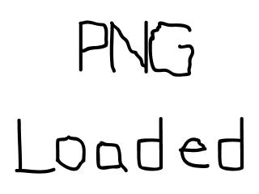

# Lazy Foo' Productions
# Loading PNGs with SDL_image



Now that the library is all set up, let's load some PNGs.
```cpp
//Using SDL, SDL_image, standard IO, and strings
#include <SDL.h>
#include <SDL_image.h>
#include <stdio.h>
#include <string>
```
To use any SDL_image function or data types, we need to include the SDL_image header. We'd have to do the same for SDL_ttf, or SDL_mixer.
```cpp
bool init()
{
//Initialization flag
bool success = true;
//Initialize SDL
if( SDL_Init( SDL_INIT_VIDEO ) < 0 )
{
printf( "SDL could not initialize! SDL Error: %sn", SDL_GetError() );
success = false;
}
else
{
//Create window
gWindow = SDL_CreateWindow( "SDL Tutorial", SDL_WINDOWPOS_UNDEFINED, SDL_WINDOWPOS_UNDEFINED, SCREEN_WIDTH, SCREEN_HEIGHT, SDL_WINDOW_SHOWN );
if( gWindow == NULL )
{
printf( "Window could not be created! SDL Error: %sn", SDL_GetError() );
success = false;
}
else
{
//Initialize PNG loading
int imgFlags = IMG_INIT_PNG;
if( !( IMG_Init( imgFlags ) & imgFlags ) )
{
printf( "SDL_image could not initialize! SDL_image Error: %sn", IMG_GetError() );
success = false;
}
else
{
//Get window surface
gScreenSurface = SDL_GetWindowSurface( gWindow );
}
}
}
return success;
}
```
Now that we're using SDL_image, we need to initialize it. Here we want to initialize SDL_image with PNG loading, so we pass in the PNG loading flags into IMG_Init. IMG_Init returns
the flags that loaded successfully. If the flags that are returned do not contain the flags we requested, that means there's an error.

When there's an error with SDL_image, you get error string with IMG_GetError as opposed to SDL_GetError.
```cpp
SDL_Surface* loadSurface( std::string path )
{
//The final optimized image
SDL_Surface* optimizedSurface = NULL;
//Load image at specified path
SDL_Surface* loadedSurface = IMG_Load( path.c_str() );
if( loadedSurface == NULL )
{
printf( "Unable to load image %s! SDL_image Error: %sn", path.c_str(), IMG_GetError() );
}
else
{
//Convert surface to screen format
optimizedSurface = SDL_ConvertSurface( loadedSurface, gScreenSurface->format, NULL );
if( optimizedSurface == NULL )
{
printf( "Unable to optimize image %s! SDL Error: %sn", path.c_str(), SDL_GetError() );
}
//Get rid of old loaded surface
SDL_FreeSurface( loadedSurface );
}
return optimizedSurface;
}
```
Our image loading function is pretty much the same as before, only now it uses IMG_Load as opposed to SDL_LoadBMP. IMG_Load can load many different types of format which you can find
out about in the [SDL_image documentation](http://www.libsdl.org/projects/SDL_image/). Like with IMG_Init, when there's an error with IMG_Load, we call
IMG_GetError to get the error string.

Download the media and source code for this tutorial [here](zip/06_extension_libraries_and_loading_other_image_formats.zip).
